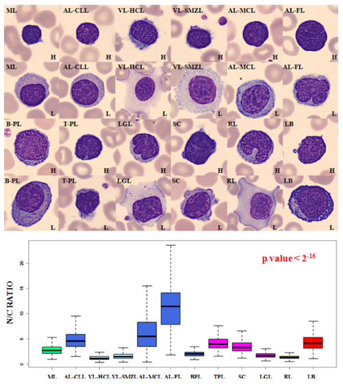
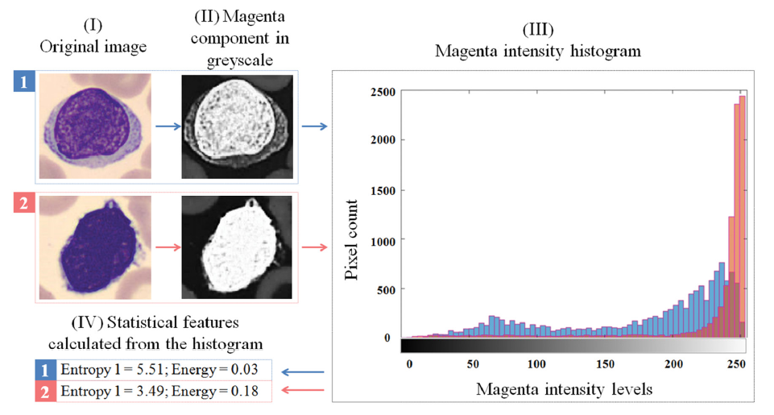
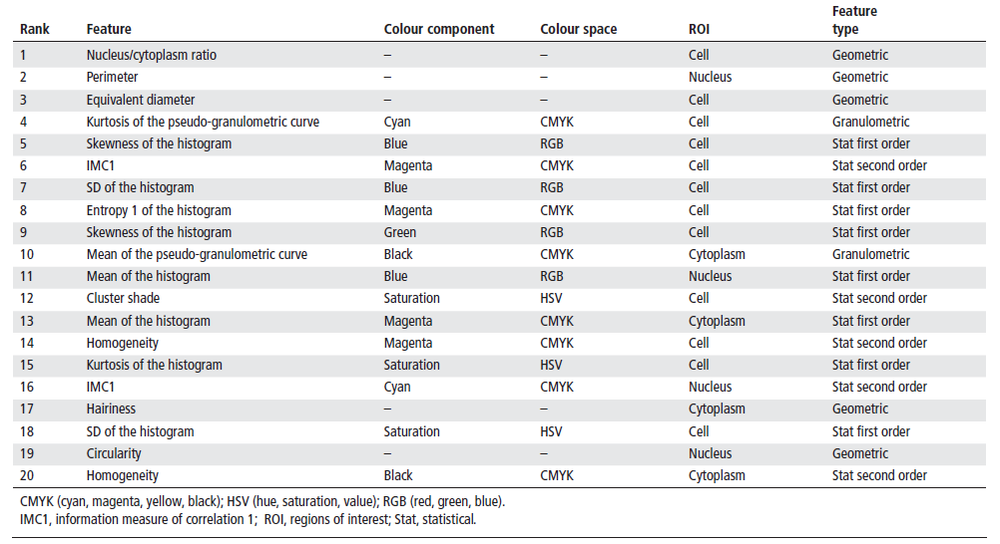

```{r setup, include=FALSE}
knitr::opts_chunk$set(echo = TRUE, fig.lp = "Figura ", tidy.opts=list(width.cutoff=60),tidy=TRUE, cache = TRUE, fig.width=12, fig.height=4, comment = NULL, out.height='200px', dpi=200, fig.pos = 'h', out.extra = '')
```

```{r library_load, echo=FALSE, message=FALSE}
require(knitr)
require(ggplot2)
require(reshape2)
```

\pagebreak  

#1 - Introduction

The current project is framed in the context of lymphocyte classification. Lymphocyte classification is achieved through the evaluation of morphologic, geometric and colorimetric features. Dimension reduction, or dimensionality reduction, is the process through which the number of variables observed in a study is reduced to a "manageable" number, considering as "manageable" that which produces the best prediction accuracy while keeping the noise and processing requirements to a minimum.  

**Machine learning** algorithms are expensive in processing power and benefit from appropriate data representations in the form of constructed features derived from the original input. There are a number of feature construction methods, both supervised and unsupervised, such as **clustering** (replacing a number of *similar* variables by a cluster centroid), **basic linear transforms** (such as *SVD*, *Singular Value Decomposition*, which reconstructs the data in the form of the best linear combination in the least square sense), **Fourier Transforms**, and also simple, task-specific functions [@Guyon2003].  

While dimension reduction is useful in every field of application of **Machine Learning**, the proposed area for this project is the morphological analysis of lymphocytes. Lymphocytes are classified as *normal*, *abnormal* or *reactive* attending to morphological features, being neoplasic lymphoid cells the most difficult to be recognized by only qualitative morphologic features [@Puigvi2017]. The chosen topic for this project is the comparison of the behaviour of different dimension reduction techniques applied to this study.  

##1.1 - Context and justification for the project  

The term *Lymphoma* defines a group of very common white blood cell cancers that affect both adult individuals and children. Symptoms include sweating, itches, enlarged lymph nodes, fever and a prolonged feeling of fatigue. It is classified into many subtypes, being first and mainly divided into Hodgkins and non-Hodgkins lymphomas, and then subdivided in dozens of subtypes. The correct diagnosis and treatment of lymphoma offers a significant survival rate.  

This diagnosis involves, as part of the protocol, visual morphological analysis of peripheral blood cells in the form of a blood smear (Fig. 1). This is an expert-driven field in which interobserver and intraobserver variations may supose a hindrance [@Puigvi2017]. The categorisation of cells depends on morphological features such as **nucleus morphology**, **hairiness** or **nucleus-cytoplasm proportions**.  

```{r echo=FALSE, fig.env='figure', fig.pos = 'h', out.extra = '', out.width='100%', fig.align='center', fig.cap='Microscopic image of blood smear containing lymphocytes (purple, with granulated nuclei) (Source: Euthman, https://www.flickr.com/photos/euthman/2869815349 )'}
knitr::include_graphics('./images/2-blood-smear.jpg')
```

The morphological features of peripheral blood cells were first translated into a mathematical scoring system by Benattar and Flandrin [@Benattar2001]. Mathematical measurement of these features induces intraobserver and interobserver objectivity and allows for a quantitative assesment of cell features, being the ones in abnormal lymphocytes the most difficult to identify. Thus, mathematical morphology tools have been developed with the aim of processing peripheral blood images and extracting and processing sets of features which are then used to classify the cell. These features need to be constructed and optimized for best performance and accuracy of the derived classification, or, in some cases, risk being affected by the *Curse of Dimensionality*.  

The *Curse of Dimensionality* is a common problem for many data analysis fields, in that as the dimensionality (number of observed features, or number of dimensions) of the data grows, the analytic space grows exponentially with each added dimension; even though the initial number of samples may be optimized for a study, the real quantity of information quickly grows "sparse" as the dimensionality of the study grows. In many *nearest neighbor* approaches to data analysis this problem is buffered by the fact that *significant* new dimensions also offer more contrast between points, so it is those *noise* dimensions that need to be identified and suppressed.  

This can be managed by dimension reduction methods, as it has been in [@Puigvi2017] and [@Alferez2015]. The most complete set of features is described in detail in the former, in the *Materials and Methods* section. In this study, a total of 325 patients were included (Fig.2), for a total of 12574 cell images. This images were obtained using the CellaVision DM96.  

```{r distribution, echo=FALSE, fig.env='figure', fig.pos = 'h', out.extra = '', fig.align='center', fig.cap='Distribution of lymphoid cell groups, number of patients and images included in the study (Source: Puigví et al.)'}
knitr::include_graphics('./images/4-distribution-images')
```

Three *ROIs* (Regions of Interest) are obtained (nucleus, whole cell and peripheral zone around the cell), and a fourth *ROI* is obtained as the difference between cell and nucleus regions (Fig.3). Features are divided in geometric features and color-texture features, all of them measured quantitatively.  

```{r ncratio, echo=FALSE, fig.env='figure', fig.pos = 'h', out.extra = '', out.width='6in', fig.align='center', fig.cap='Examples of different cells, showing differential nucleus/cytoplasm ratio, with associated boxplots (Source: Puigví et al.)'}

```

All in all, 27 geometric features (including **area**, **perimeter** and **N/C ratio**) and 2649 colour-texture features (43 texture features applied through six colour spaces: **RGB**, **CMYK**, **XYZ**, **Lab**, **Luv** and **HSV**) are extracted, for a total of 2676 features.  

```{r grayscale, echo=FALSE, fig.env='figure', fig.pos = 'h', out.extra = '', out.width='100%', fig.align='center', fig.cap='Magenta component grayscale decomposition and associated histogram (Source: Puigví et al.)'}

```

The problem of dimensionality is solved through dimension reduction techniques (theoretic feature selection), decreasing the number of features to a more relevant, less redundant subset of 20 features (Fig.5), and malignant diagnoses were confirmed following the WHO classification.  

```{r relevant_features, echo=FALSE, fig.env='figure', fig.pos = 'h', out.extra = '', out.width='6in', fig.align='center', fig.cap='20 most relevant, less redundant features selected (Source: Puigví et al.)'}

```

Data analysis was performed with R code, validating for residual normality through Kolmogorov-Smirnov, homocedasticity through Flingner-Killeen, significance through Kruskal-Wallis and multiple comparisons through Kruskal-Wallis after Dunn tests applying a Bonferoni adjustment.  

The selected features allowed for the quantification of different morphological characteristics with significant p-values, being *N/C ratio* the best feature for distinction.

As has been mentioned, the correct diagnosis of lymphoma offers a significant survival rate, an as such, every single step of the classification protocol should be optimised for best performance, both in terms of accuracy and costs. Thus, the justification for this project on a scientific level is to compare the feasibility of several dimension reduction techniques applied to the classification of lymphoma. This comparison will be made through an accuracy scoring result.

The accuracy of a prediction is the proportion of true positives plus true negatives against the total prediction result. It measures the amount of cases in which the observed results matched the expected results. Errors in prediction may or may not have the same "weight" for a given problem (as an example, a false positive in cancer diagnosis may raise an unnecesary alarm; a false negative may cause a lack of treatment and so, a serious health issue). This project will, through understanding of the context of the mentioned study, establish an accuracy scoring system, determine if different errors have different costs, compare scores, and analyse the results for conclussions both on comparison of techniques and the implications of the scoring system.  

##1.2 - Project goals  

###1.2.1 - General goals  

The goal of this project is to **compare several techniques of dimension reduction** through the construction of significant features and their respective results given a classification workflow. This classification workflow should differentiate normal, abnormal and reactive lymphoid cells. The resulting accuracy values will serve as scoring for the features constructed, and as such, for the objective assesment of the behaviour of the dimension reduction techniques behind them.  

###1.2.2 - Specific goals  

**Specific goals for Phase 1 (17-10-2017 through 20-11-2017)**  

1 - To design a **comparison protocol** for different dimension reduction techniques.  

1.1 - To research, understand, brief on, and choose an array of dimension reduction techniques for comparison.  

1.2 - To choose a programming environment to work with (languages, frameworks...)  

1.3 - To assess the methods of, understand and ultimately extract a subset of functions from the appointed languages and frameworks to apply to the test data.  

**Specific goals for Phase 2 (21-11-2017 through 18-12-2017)**  

2 - To apply this protocol to each technique within the frame of lymphocyte classification, achieving an **objectively quantifiable scoring system**.  

2.1 - To set a scoring system to satisfy the need for an objective measure of accuracy. This scoring system will include weighing of types of errors.  

2.2 - To apply each of the selected dimension reduction techniques, under equivalent parameters, to the test data.  

2.3 - To classify the behaviour of the referred techniques, based on the selected scoring system, as applied to the stated problem (lymphocyte classification)  

##1.3 - Focus and followed method  

Given the specific goal of this project (the comparison of dimension reduction techniques), the focus to accomplish it will be directed to the evaluation of the accuracy of classification tasks implementing each of these techniques. Feature construction aims to explain the most variance through the less possible, most explicative, features. For a constant given amount of variance explained through variables in a classification task, the accuracy of the predicted classes improves while the number of dimensions decreases.  

The methods to accomplish this will be a selection of dimension reduction techniques, including **PCA**, **ICA** and **Factor Analysis** amongst others, applied to the problem dataset and used as input for the same machine learning classification algorithm (SVM with an RBG kernel).  

This method has been evaluated as the most appropriate, as it makes it possible to subject the objects of evaluation to an equal environment, under equal conditions, and give out a numerical, objective measure of correlation with observed results.  

##1.4 - Project plan  

###1.4.1 - Tasks

**Tasks for Phase 1:**  

1.1.1 - Choose a subset from the most used and widely applied dimension reduction techniques appliable to the present topic, including **PCA**, **ICA** and **Factor Analysis**. (1 week, 21 hours equivalent)  

1.2.1 - Elaborate a list of widely bioinformatics-applied languages (and frameworks, if used within one). (7 days, 21 hours equivalent)  

1.2.2 - Choose a subset from those languages and frameworks and elaborate a briefing of characteristics and examples of application. (3 days, 9 hours equivalent)  

1.3.1 - Elaborate a list of dimension reduction packages and functions from chosen languages. (7 days, 21 hours equivalent)  

1.3.2 - Choose a subset and elaborate a briefing of package traits: optimal application, parameters, example workflows it has actually been used for, etc. (4 days, 9 hours equivalent)  

1.3.3 - Elaborate monitoring report for **Phase 1**. (7 days, 21 hours equivalent)

**Tasks for Phase 2:**  

2.1.1 - Elaborate a short briefing on the value of prediction accuracy as output by this packages. (4 days, 12 hours equivalent)  

2.1.2 - Assess the validity of it for all the packages selected, and, if it is not valid for all of them, extrapolate a valid, normalized scoring system. (6 days, 18 hours equivalent)  

2.2.1 - Apply each and every package's or function's workflow to the supplied lymphocyte data. (4 days, 12 hours equivalent)  

2.3.1 - Present the score output of each of the applications in a user-friendly manner. (3 days, 9 hours equivalent) 

2.3.2 - Extract behaviour/comparison conclussions from this score output. (4 days, 12 hours equivalent)

2.3.3 - Elaborate monitoring report for **Phase 2**. (8 days, 24 hours equivalent)

###1.4.2 - Calendar

The following Gantt diagram represents the division of time through the proccess of this project:  

```{r calendar, echo=FALSE}
task1 <- c('1.1.1 - Choose DR Techniques', '2017-10-17', '2017-10-23')
task2 <- c('1.2.1 - List languages', '2017-10-23', '2017-10-30')
task3 <- c('1.2.2 - Choose languages', '2017-10-30', '2017-11-02')
task4 <- c('1.3.1 - List packages and functions', '2017-11-02', '2017-11-09')
task5 <- c('1.3.2 - Choose packages and functions', '2017-11-09', '2017-11-13')
task6 <- c('1.3.3 - Elaborate monitoring report 1', '2017-11-13', '2017-11-20')
task7 <- c('2.1.1 - Elaborate accuracy briefing', '2017-11-20', '2017-11-24')
task8 <- c('2.1.2 - Assess validity of accuracy', '2017-11-24', '2017-11-30')
task9 <- c('2.2.1 - Application of workflows', '2017-11-30', '2017-12-03')
task10 <- c('2.3.1 - Presentation of score', '2017-12-03', '2017-12-06')
task11 <- c('2.3.2 - Extract conclussions', '2017-12-06', '2017-12-10')
task12 <- c('2.3.3 - Elaborate monitoring report 2', '2017-12-10', '2017-12-18')

tasks <- as.data.frame(rbind(task12, task11, task10, task9, task8, task7, task6, task5, task4, task3, task2, task1))
names(tasks) <- c('task', 'start', 'end')
tasks$task <- factor(tasks$task, levels = tasks$task)
tasks$start <- as.Date(tasks$start)
tasks$end <- as.Date(tasks$end)
tasks_melted <- melt(tasks, measure.vars = c('start', 'end'))

start_date <- as.Date('2017-10-17')
 
ggplot(tasks_melted, aes(value, task)) + 
  geom_line(size = 5, colour = "blue") +
  labs(x = '', y = '', title = 'Task time allocation - Gantt Chart') +
  theme_bw(base_size = 30) +
  theme(plot.title = element_text(hjust = 0.5),
        panel.grid.major.x = element_line(colour="black", linetype = "dashed"),
        panel.grid.major = element_blank(),
        panel.grid.minor = element_blank(),
        text = element_text(size=12),
        axis.text.x = element_text(angle = 0)) +
  scale_x_date(date_labels = "%d %b %Y", limits = c(start_date, NA), date_breaks = '1 week')
 
```

###1.4.3 - Milestones

The following tables represent the milestones for each development phase.  

```{r phase_1_milestone_table, echo=FALSE}
ms_1 <- c("01-NOV-2017","Array of candidate bioinformatics languages, tools and protocols assessed")
ms_2 <- c("20-NOV-2017","Definitive subset of bioinformatics languages, tools and protocols selected")
ms_3 <- c("20-NOV-2017","Monitoring report for Phase 1")
p1_ms <- data.frame(rbind(ms_1,ms_2,ms_3)) 
kable(p1_ms, caption = "Phase 1 milestones", align = c('l','l'), col.names = c("Deadline","Milestone"), row.names = FALSE)
```

```{r phase_2_milestone_table, echo=FALSE}
ms_4 <- c("28-NOV-2017","Scoring system completely defined")
ms_5 <- c("08-DEC-2017","Complete set of workflows applied")
ms_6 <- c("18-DEC-2017","Behaviour/comparison conclussions from output elaborated")
ms_7 <- c("18-DEC-2017","Monitoring report for Phase 2")
p2_ms <- data.frame(rbind(ms_4,ms_5,ms_6,ms_7)) 
kable(p2_ms, caption = "Phase 2 milestones", align = c('l','l'), col.names = c("Deadline","Milestone"), row.names = FALSE)
```

```{r postprod_milestone_table, echo=FALSE}
ms_8 <- c("02-JAN-2018","Final report produced and delivered")
ms_9 <- c("10-JAN-2018","Virtual presentation produced and delivered")
pp_ms <- data.frame(rbind(ms_8,ms_9)) 
kable(pp_ms, caption = "Post-production milestones", align = c('l','l'), col.names = c("Deadline","Milestone"), row.names = FALSE)
```

###1.4.4 - Risk analysis

Some of the factors that could hinder the proposed work frames are the following:

1. Technical problems: a short buffer of time must be allocated for unexpected technical problems stemming from equipment malfunction, infrastructure breakdown, etc. Measures covering these problems include a recurrent backup system, cloud storage and accessibility to the project and its resources from several, if controlled, workstations.  

2. Goal overextension: an incorrect or exaggerated choice of dimension reduction techniques or an overambitious reach could mean an ineffective use of time. This is controlled by allocating an initial time for a detailed judgement and selection of techniques to include in this project's comparison goal.  

3. Incompatibilities: accuracy measurements between packages or functions in different languages or frameworks could demonstrate to be incompatible between them, or not fit to compare; this is avoided through both the allocation of time for a strict selection of these languages and frameworks, and for the production of a normalized scoring system.  

Although there are many other factors that could mean an obstacle for the correct development of each phase, they are not foreseeable and, thus, to be assessed on an occurrence basis.  

###1.4.5 - Associated project costs

Economical costs for the present project will be only those associated with infrastructural uses (power and time used for computation), as all implemented software will be Open Source.  

###1.4.6 - Ethical and legal data implications

All data included in this project is anonymous and carries no risk for specific study patients. Even so, no data set will be made available for the public, and all computation and data presented will be in the form of final results in which no specific person will be addressed.  

##1.5 - Brief summary of products obtained  

###1.5.1 - Work plan

A document pertaining the project's planification will be delivered by October the $16^{th}$, this being it. This document's aim is to reflect the project's expected goals and tasks to accomplish and the time frames in which to fit them. Pragmatism is expected in this planning, meaning the ability to fit realistic goals and tasks in realistic timeframes, acknowledge possible hindrances and obstacles, and establishing procedures to avoid or sort them out.  

This project's work plan is been rendered via R, using packages **Rmarkdown**, **ggplot2**, **knitr**, and **reshape2**. The embedded Gantt graph is produced via **ggplot2** and **reshape2**, from an input of tasks in data frame format and a series of graphic parameters.  

This document will also establish the products that will stem from the project, any additional outputs, and the monitoring and evaluation thereof.

###1.5.2 - Report

Three reports will be made through this project's duration, structured as follows:  

The first one will be a monitoring report, due November the $20^{th}$, in which the project's ongoing evolution will be described. This will be composed of the description itself, a complete relation of overtaken activities, both foreseen and unforeseen, a relation of hindrances and obstacles and the measures taken to buffer them, complete with an update of time frames, a list of delivered partial results and any particular comment by the project's tutor.  

Another monitoring report, due December the $18^{th}$, will be generated with contents similar to the first one, this time with a focus on the completed second phase of the project and the degree of accomplishment of the planned goals for it.  

The final report, due January the $2^{nd}$, with a maximum length of 90 pages, will present the output of the project, with a justification of its interest, goals, methodology and materials, and results obtained.

###1.5.3 - Product

In the course of this project, an automated comparison report script will be produced. The code used will be added as an addendum to the final report, along with code comments and protocols of use. The code will be stored in a GitHub repository, available for the public to clone, review and use. GitHub is a version-control platform used to store git repositories, with an emphasis on open-source, collaborative efforts and project versioning. Mendeley will be used as referencing tool, syncronized with R Markup through an embedded *.bib* file.

###1.5.4 - Virtual presentation

The virtual presentation for this project will be carried out through **Present@**, a presentation tool offered by **Universitat Oberta de Catalunya** for the display of project results. This presentation will be comprised of approximately 20 slides with an oral presentation for a maximum of 20 minutes. This presentation's aim is to be as concise and informational as possible, while delivering the results and conclussions of the project in a clean, outreaching way.  
The presentation will be produced between the $3^{rd}$ and $10^{th}$ of January 2018, January the $10^{th}$ being the deadline. Of special importance is the content, synthetic ability and clarity of purpose and expression. Evaluation criteria have been provided by the project's tutor.

###1.5.5 - Project self-evaluation

This project's self-evaluation will confront it from two angles: first, a side-by-side comparison of initial goals and time schedules and final, actual results and time schedules, and second, a thorough analysis of style, clarity and informative value. Being this:  

**Goals and schedules:**  
1 - Correct assertion of techniques to compare: the techniques assessed are widely used, available to the general research personnel, and suited for the task at hand. Also, the number of techniques is decided pragmatically, avoiding overextension and, thus, decrease in effective time.
2 - Validity of scoring system and conclussions: the scoring system is, by itself or through normalisation, fit to give an objective, comparable value. The conclussions that follow are in agreement with this scoring system.
3 - Adecuation of assigned times: the assigned times corresponded to the times actually employed for each task, and so, milestones are accomplished within the expected period.  

**Style and structure:**  
1 - Style: the project is easily readable, is expressed in a correct way, follows correct style guidelines, quotes and references are strictly marked.  
2 - Structure: the project follows the structure established by the documentation provided through the subject. Contents are correctly divided in sections. The project as a whole presents a semantic flow without logical leaps that may hinder the reader's comprehension.  


##1.6 - Brief description of other chapters  

**"Dimension reduction: an introduction"**: A brief presentation of the main topic in this project. What they are, what they are useful for.  
**"PCA"**: 

#2 - All other chapters  

##2.1 - Dimension reduction: an introduction  

Actual data derived from actual studies, as opposed to ideal, condition-controled data, is mudded by the complexity of reality, and in order to approximate it, needs to be measured by large quantities of variables, giving up high dimensionality datasets, as may be the case of digital imaging, speech recognition or complex classification tasks. This high dimensionality needs to be adequately reduced in order to make studies attainable, able to be handled effectively. In fact, not all the measured variables may be "important" to the goal of a study.

This can be mathematically formulated as follows [@Fodor2002]:  

Given the *p*-dimensional random variable $x = (x_1,...,x_p)^{T}$, we need to find a lower dimensional representation of it, $s = (s_1,...,s_k)^T$ with $k \le p$ that captures the information in the original data.

Ideally, this involves constructing a representation of the data according to its intrinsic dimensionality. The intrinsic dimensionality of data is the minimum number of parameters needed to account for the oberserved properties of the data [@VanDerMaaten2009]. As a result, many techniques have been developed, both supervised and unsupervised, to handle the construction of this representation.  

Traditionally, dimensionality reduction techniques relied in linear transformations, like those used in *PCA* (Principal Component Analysis), Factor Analysis or classical scaling. Linear techniques result in newly constructed features that are a linear combination of the originals. However, given that in many fields, complex, nonlinear data is obtained, many other nonlinear methods have been developed, like Autoencoders, nonlinear applications of *PCA*, Kernel *PCA*, Laplacian Eigenmaps, etc.  

The techniques used for this project will be described in the next subsections. History, mathematical background and reasons for its selection will be addressed where available. Further along this document, programming applications and protocols will be addressed.  

##2.2 - PCA  

PCA is the most used unsupervised, linear dimension reduction technique currently available. It is also the best, in the mean-square error sense [@Fodor2002]. Its central idea is the construction of a set of features from a number of initial variables [@Jolliffe2002]. The number of new features will be less than the initial variables, while retaining as much as possible of the initial variation. This is achieved by linear transformations of the original data, and then establishing a descending order of the new features attending to the amount of variation retained or explained by each of them.  

Given $X$, a vector of *p* random variables, as object of interest for any study, and given that $X$ is complex enough, the raw study of the correlation between variables may get to be inefficient and expensive in time and effort. Instead of getting the *p* variances and the $\frac{1}{2}p(p -1)$ correlations for each sample in the study, the goal is to search for less, equally (or effectively equally) explicative features.  

###2.2.1 - Historical background  

PCA was invented in 1901 by Karl Pearson, the roots of it deeply burrowed in regression-thinking. In its first approach, which independently builds up on singular value decomposition, Pearson is concerned with finding lines and planes that best fit a set of points in a $p$-dimensional space through geometric optimization [@Jolliffe2002].  

It has been mathematically reinterpreted several times along its history. In the thirties, Hotelling takes his own approach. He introduces the term "components", as "factors", which is used in psychological literature, may create confussion with other mathematical uses of this word. His motivation is the thought that there may be a smaller set of derived variables that explain the values of the original variables. It is his own interpretation that coins the term "method of principal components".  

Hotelling gives more weight to the Principal Components axis' directions, in a much more multivariate statistical approach. In Hotelling's approach he defines the Principal Axis Property: the first component explains the most variation, the second component the second most variation, and so on. The first Principal Components define new axis to be taken into account for the next Principal Components. This means a rotation of the subspace has an effect on the resulting Principal Components [@Bro2014].  

From then on further applications and extensions of PCA have been made by researchers such as **Anderson** (1963), **Gower** (1966) or **Jeffers** (1967).  

Even though it seems to be a simple technique and much has been discussed about it, it has been applied to an extensive range of fields and is still in research.  

###2.2.2 - Mathematical background  

Let us suppose data is collected in a matrix $X$ with $I$ rows $(i = 1,...,I)$. These $I$ rows will usually be the observations or samples for the study. $X$ is also composed of $J$ columns $(j = 1,...,J)$, being these the measured variables. Each of these variables are denoted $x_j (j=1,...,J)$, and thus the matrix is of $I x J$ dimensions.  

The linear combination of these variables can be written as $t = w_1 * x_1 + ... + w_J * x_J$. The new vector $t$ is in the same *I*-dimensional space as the original variables, and it is a linear transformation of these variables. This can be expressed, in matrix notation, as $t = wX$, $w$ being the linear factor vector with elements $w_j (j = 1,..., J)$ [@Bro2014].  

As has been explained in former sections, as much information of $X$ should be carried on to $t$ as possible. With enough of that information preserved, $t$ acts as a good summary of $X$. This information can be expressed as variance, $var(t)$.  

Variance, $s^2$, is statistically almost identical to standard deviation (SD) [@Smith2002]. The formula for variance is:  

$s^2 = \frac{\sum_{i=1}^n(X_i - \bar{X})^2}{n - 1}$  

Being this just the squared SD.  

So the goal is to choose a linear transformer $w_1,...,w_J$ such that this $var(t)$ is maximized. Given that measures are subject to number sizes according to their own background, they need to be scaled down to a comparable scale, such that $w$ may really be appliable with significant results unaffected by arbitrary size changes.  

So, the problem can be expressed as $\underset{||w|| = 1}{\operatorname{argmax}} var(t)$.  

$argmax$ being the argument $w$ of length 1 that maximizes $var(t)$. Returning to matrix notation, and going back to the equation $t = wX$, the can be equaled to:  

$\underset{||w|| = 1}{\operatorname{argmax}} (t^Tt) = \underset{||w|| = 1}{\operatorname{argmax}} (w^TX^TXw)$  

Which can be solved as an eigenvector problem, being the first eigenvector the first Principal Component, the second eigenvector the second Principal Component, and so on.  

###2.2.3 - Reasons for selection  

PCA is an ubiquitous technique that is described and analyzed, in any of its many interpretations, almost in every book about feature analysis [@Tipping1999]. It's a widely used linear dimension reduction technique that has proven itself of the utmost power time and time again. As such, including it in this comparison is useful not only for the comparison of the technique itself, but as a kind of benchmark: to asses any dimension reduction technique that, applied to the subject of this study (feature construction for lymphocyte classification), is able to hold a candle to PCA.  

Also, as has been stated, PCA has been focused on from many angles, and it is expected to have been widely tackled by bioinformatics languages and tools. A suitable bioinformatics integration of this technique is expected to be found, or several, that fit this study for comparison; in an ideal context, it should be accessible, Open Source and the methods and results of this study should be easily reproducible by anyone reviewing it.

##2.3 - ICA  

Independent Component Analysis (*ICA*) is a statistical method for transforming an observed multidimensional random vector into components that are statisticaly as independent from each other as possible, this is, a tendency to **redundancy reduction** [@Tobergte2013]. In its linear approach, as with other dimension reduction algorithms, its goal is to take a zero-mean, *m*-dimensional variable, and by means of a linear transformation, find its *n*-dimensional transform, such that $n \le m$, this transformation having some suitable properties. The vectors obtained from this transformation are neither orthogonal nor ranked in order.  

Feature extraction is a prominent application of *ICA*. It is originally motivated by results in neuroscience that suggest that the same cited principle of redundancy reduction is applied by the brain for the early processing of sensory data.  

*ICA* is a generative model (it describes how the observed data are generated by describing the components), and it seeks the minimization of mutual information between the transformed variables. It depends on the supposition of nongaussianity for the data; gaussian data is independent and of mean zero, it has no skewness and as such can only be estimated up to an orthogonal transformation [@Hyvarinen2000].  

###2.3.1 - Historical background  

*ICA* is relatively modern compared to other dimension reduction techniques. It's originally introduced by Jeanny Hérault and Bernard Ans in 1984, by approach if not by name. This original application concerned neurological signals and muscle movement, and proposed a specific feedback circuit to explain how the nervous system was able to infer the position and velocity of these signals by measuring their responses [@Hyvarinen2001].  

Christian Jutten then retakes work on it by 1985, but among many other papers written in the middle 80's, *ICA* is obscured by an interest in back-propagation, Hopfield networks, and Kohonen’s Self-Organizing Map (SOM). In the early 90's, a nonlinear application of *ICA* is developed by Aapo Hyvärinen, Juha Karhunen, and Erkki Oja.  

By this time, A. J. Bell and T. J. Sejnowski publish their infomax approach to *ICA*, and S. I. Amari *et al* by using the natural gradient and maximum likelihood estimation. Some time later, Aapo Hyvärinen, Juha Karhunen, and Erkki Oja present the fixed-point or FastICA algorithm, a computation-efficient *ICA* algorithm.  

*ICA* is currently used in fields such as optical imaging, face recognition and prediction of apparently stochastic phenomena.  

###2.3.2 - Mathematical background    

Using vector-matrix notation, let us denote by **x** the random vector whose elements are the mixtures $x_1,...,x_n$, and by **s** the random vector with elements $s_1,...,s_n$, being this the independent component; **A** is the mixing matrix with elements $a_{ij}$ [@Hyvarinen2000]. Using this notation, the model for this data is $x = As$. Working with the columns of matrix **A**, and denoting them by $a_j$, the model can also be written as  

$x = \sum_{i=1}^n a_is_i$  

The mixing matrix is assumed to be unknown. As such, **A** and **s** must be estimated through the random vector **x** and the inverse of A, say **W**, may be computated, obtaining the independent component **s** as $s = Wx$. This is done under some assumptions, being these independence and non-gaussianity:  

**Independence:** two variables $y_1$ and $y_2$ are said to be independent when information on the value of one doesn't yield information on the value of the other, and viceversa. This means that the joint probability density function $p(y_1,y_2)$ is factorizable as $p_1(y_1)*p_2(y_2)$. This definition is applied given any number $n$ of terms, in which case the joint $pdf$ must be factorizable in $n$ terms.  

**Nongaussianity:** as stated in 2.3, data must be given in non-gaussian variables. Nongaussianity must be measurable, and the classical way to measure it is the kurtosis of the fourth order cumulant. Kurtosis of a variable $y$ of mean zero and variance one is defined as:  

$kurt(y) = E\{y^4\} - 3(E\{y^2\})^2$  

As variance of $y$ is stated to be of value one, it can be simplified to:  

$kurt(y) = E\{y^4\} - 3$  

For almost all nongaussian variables, kurtosis will be non-zero. Another measure of nongaussianity is negentropy. Entropy can be considered as the amount of information that a variable yields. Randomness and unpredictability of a variable are proportional to entropy. Negentropy is a variation of entropy that aims to be zero for a gaussian variable and always nonnegative. Negentropy of a variable $y$ is defined as:  

$J(y) = H(y_{gauss} - H(y))$  

Where $H(y_{gauss})$ is the entropy value of a gaussian variable of the same covariance as $y$. This way, negentropy is always nonnegative and $J(y)$ is only zero if the entropy of $y$ is the same as that of its equivalent gaussian variable, this is, its gaussian itself.  

###2.3.3 - Selection  

Other studies have already been centered around the comparison of *PCA* and *ICA* on different fields, such as [@TibaduizaBurgos2013] or [@Pet2010]. *ICA* is a widely-used, exhaustively applied to bioinformatics linear dimension reduction technique that rivals *PCA* in terms of use. Algorithms for this technique have been developed in popular bioinformatics programming languages, in Open Source environments, that are available for researchers to use.

*ICA* uses a different method to derive principal components, being this nongaussianity. Even though this tecnique doesn't rank principal components, this is not critical to the present study, as the main objective is the accuracy of prediction.  

For this reasons (wide use, availability in Open Source environments, different approach to principal components), *ICA* has been selected for this comparison study.  

##2.4 - Factor Analysis  

The basic idea underlying Factor Analysis is that *p* observed random variables, **x**, can be expressed, except for an error term, as linear functions of $m(<p)$ hypothetical (random) variables or *common factors* [@Jolliffe2002]. The aim of Factor Analysis is to group variables that share a "common theme" under the same grouping, such that the dimensionality of the dataset is decreased.  

Factor Analysis has been applied in psychology to identify groups of inter-related variables, as those components of intelligence that can be placed under a single factor *g* or *general intelligence*, grouping factors such as *broad visual perception* (it includes all the intelligence variables related to visual tasks), or *broad auditory percention* (same as before, but with auditory tasks). This is interpreted as someone with a high *g* having good *broad auditory and visual perceptions*, and *g* sinthetically explaining the behaviour of the factors and variables "contained" within itself.

###2.4.1 - Historical background  

The origin of factor analysis, initially applied to the field of psychology, is usually ascribed to Charles Spearman back in 1904. He worked to develop a psychological theory involving a single general factor and a number of specific factors. In this phase of development, "factors" were still not mentioned explicitly. In the next twenty years a lot of work would go into following advancements in this theory, with researchers such as Cyril Burt, Karl Pearson, Godfrey H. Thompson, J. C. Maxwell Garnett and Karl Holzinger. Special mention goes to Karl Pearson, who devoted the remaining forty years of his life to the study of *Factor Analysis* [@HarryHHarman1976].  

The term "factors" as applied to latent-ability variables grouping other explicit variables comes with L. L. Thurstone in the 30s. He added a component of hyerarchically organization to the mind, and sought to find factors which related to observed variables in a way that each of them pertained as much as possible to one overlapping subset of them.  

In the 50s and 60s factor analysis entered the age of large-scale computing. It was applied blindly to all sorts of data, and whether it often succeeded in providing significant explanations for relationships between variables is a topic for debate. As an example, blind, computerised factor analysis failed to provide a meaningful account of the structure underlying Rorschach Test score variables.  

The major advancements, in a statistical, mathematical and computational sense, were made by Karl Jöreskog, in the University of Uppsala, in Sweden. He developed a maximum-likelihood estimation algorithm that has, since then, been applied in most commercial computer programs ever since. He himself, and Bock and Bargman (1966) pre-sprecify various parameters about the common factor analysis model relating manifest variables to latent variables according to a structural theory. This model is then used to generate a covariance matrix that is testes for goodness of fit to an empirically-tested covariance matrix. This has had the effect of guiding later researchers to a protocol of action where variables are assessed before blind application of factor analysis to a dataset [@StanleyAMulaik2009].  

###2.4.2 - Mathematical background  

Factor analysis is a method for investigating whether a number of variables of interest $Y_1, Y_2,..., Y_l$, are linearly related to a smaller number of unob- servable factors $F_1, F_2,..., F_k$.  

Let us consider $Y_1$, $Y_2$ and $Y_3$ as variables in a study [@Tryfos1998]. Through factor analysis, it may be postulated that these variables are functions of two underlying factors, $F_1$ and $F_2$, that can be described or named in a fitting way with the intent of handling them. It is assumed that the original variables linearly relate to the two factors as follows:  

$Y_1 = \beta_{10} + \beta_{11}F_1 + \beta_{12}F_2 + e_1$  
$Y_2 = \beta_{20} + \beta_{21}F_1 + \beta_{22}F_2 + e_2$  
$Y_3 = \beta_{30} + \beta_{31}F_1 + \beta_{32}F_2 + e_3$  

The modeled formulas include an error term each. The $\beta$ parameters are technically referred as *loadings*. Factor loadings are numerical measures of how much a factor explains a variable. Loadings can range from -1 to 1, with absolute values near 1 indicating that a factor strongly affects a variable. Factor loadings can be interpreted as standardized regression coefficients. Loadings as high as ~0.6 can be interpreted as strong associations between a factor and a variable.  

The simplest method of Factor Analysis is based on two assumptions:  

- That the error terms are independent, of mean 0 and variance $\sigma^2$.  
- That the unobservable factors $F_j$ are independent of one another and of the error terms, and of mean 0 and $\sigma$ 1.  

Given this assumptions, each variable can be formulated as:  

$Y_i = \beta_{i0} + \beta_{i1}F_1 + \beta_{i2}F_2 + (1)e_i$  

And, to obtain the associated variance:  

$Var(Y_i) = \beta_{i1}^2Var(F_1) + \beta_{i2}^2Var(F_2) + (1)^2Var(e_i) = \beta_{i1}^2 + \beta_{i2}^2 + \sigma_i^2$  

Splitting this variance definition in two parts, $\beta_{i1}^2 + \beta_{i2}^2$ is what is called the *communality*, and $\sigma_i^2$ is the *specific variance*. The *communality* denotes the part of the variance that is explained by the common factors $F_1$ and $F_2$. The second, the *specific variance*, is the part of the variance of the variable $Y_i$ that is **not** explained by the common factors. The aim, then, is to minimise this *specific variance*, $\sigma_i^2$.  

The loadings are not unique. There exist an infinite number of sets of values of $\beta_{ij}$ that yield the same variances and covariances.

###2.4.3 - Selection  

Factor Analysis is inexpensive and simple to use. It has been extensively integrated in many programming languages, some of the most powerful, Open Source and community-supported, like **R**. It's a great support tool when used in conjunction with other dimension reduction methods, and it can yield not only the aforementioned dimension reduction, but also an insight on the relation between the original variables and structure that may be add a further value to this method.  

For all these reasons, Factor Analysis has been selected as one of the techniques to assess in this project.  

##2.5 - Autoencoders  

Even though there are many types of autoencoders and all will be at the least mentioned in this section, **denoising autoencoders** will be the main subject of this project in this area, and they will be explained in more depth.  

An autoencoder is an unsupervised machine learning algorithm, with an emphasis on feature extraction, that applies backpropagation, setting the targets to be equal to the inputs. The aim of the autoencoder is to learn a function $h_{W_b}(x) \approx x$ [@ufldltutorial].  

Briefly explained, an autoencoder, through at least an input layer, an output layer and a hidden layer, tries to encode and decode data such that the output layer's result is as similar as possible to the original data, and, in the process, attempts to learn the identity function, this is, the central layer is the real goal. Even though autoencoders have enough freedom to easily be able to overfit the model, when handicapped with different types of constraints they can find interesting traits of the data structure. There are different ways to achieve this:  

- Sparse autoencoders: Autoencoders can be imposed strong requirements for the units in its hidden layers to "fire up". This may be achieved by adding terms to the loss function, or by considering as zero every activation score but for those nearest to 1. This produces the so called sparsity and makes it possible to learn structural traits about the studied data.  

- Variational autoencoders: Variational autoencoders use **Stochastic Gradient Variational Bayes** (*SGVB*) to add losses by generating latent vectors that more or less follow a gaussian distribution.  

- Contractive autoencoders: Contractive autoencoders try to impose small variations on the mapping by the hidden layer when inducing similar small variations in the input data, which reduces the chance of overfitting and makes the function more applicable to generalised data[@Rifai2011].  

- Denoising autoencoders: Denoising autoencoders, which will be the focus of this study, are autoencoders that put an emphasis on constructing a good representation of a model, this being **one that is able to fill in gaps in data**. This is accomplished by introducing noise in the input (i.e. partially destroying it). If the output of the model is similar to the uncorrupted version of the input, then that is a good representaction [@Vincent2008]. Then repeat the process by corrupting the input in a different way. What was just described is an unsupervised initialization by explicit fill-in-the-blanks training.  

Other corruption processes are possible. 

Autoencoders' extracted features can be used in other classification algorithms, as will be done in this project.  

###2.5.1 - Historical background  

Not much autoencoder historical background is addressed in current literature. [@Chen2017] states that, as autoencoders have evolved gradually and much of the terminology has changed and evolved with it, it's difficult to put a finger on the origin of all ideas used in them. Even so, [@Ballard1987] first proposes them in 1987 as an unsupervised pre-training method for **Artificial Neural Networks** (*ANNs*).

###2.5.2 - Mathematical background  

Let $P(X)$ be the data-generating distribution over observed random variable $X$ [@Bengio2013]. Let $C$ be a given corruption process that stochastically maps an $X$ to a $\tilde{X}$ through conditional distribution $C(\tilde{X}|X)$. The training data for the generalized denoising auto-encoder is a set of pairs $(X, \tilde{X})$ with $X \sim P(X)$ and $\tilde{X} \sim C(\tilde{X}|X)$. The DAE is trained to predict $X$ given $\tilde{X}$ through a learned conditional distribution $P_\theta(X \mid \tilde{X})$, by choosing this conditional distribution within some family of distributions indexed by $\theta$, not necessarily a neural net. The training procedure for the DAE can generally be formulated as learning to predict $X$ given $\tilde{X}$ by possibly regularized maximum likelihood, i.e., the generalization performance that this training criterion attempts to minimize is  

$L(\theta) = -E[log P_\theta(X\mid\tilde{X})]$  

where the expectation is taken over the joint data-generating distribution  

$P(X, \tilde{X}) = P(X) C (\tilde{X} \mid X)$   

###2.5.3 - Selection  

Autoencoders, specifically stacked denoising autoencoders, have been stated to perform well as feature constructors in machine learning classification algorithms [@Vincent2008]. This unsupervised algorithm is a modern addition to the pool of existing feature construction techniques, backed by a copious amount of literature, and applied to several bioinformatics-focused programming languages. Thus it has been selected for this project.

#3 - Conclussions  

#4 - Glossary  

#5 - Annexes  

#6 - References  

