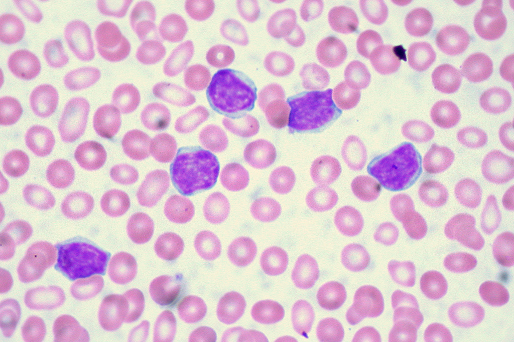

```{r setup, include=FALSE}
knitr::opts_chunk$set(echo = TRUE, engine.path = list(python = 'C:/Program Files (x86)/eMule/python/python.exe'), fig.lp = "Fig. ", tidy.opts=list(width.cutoff=60),tidy=TRUE, cache = TRUE, fig.width=12, fig.height=4, comment = NULL, out.height='200px', dpi=200, fig.pos = 'h', out.extra = '')
```


```{r library_load, echo=FALSE, message=FALSE}
require(knitr)
require(stats)
require(caret)
require(e1071)
require(ica)
require(psych)
require(MASS)
require(ggplot2)
require(ggfortify)
require(reshape2)
require(DMwR)
```

\pagebreak  

#1 - Introduction

The current project is framed in the context of lymphocyte classification. Lymphocyte classification is achieved through the evaluation of morphologic, geometric and colorimetric features. Dimension reduction, or dimensionality reduction, is the process through which the number of variables observed in a study is reduced to a "manageable" number, considering as "manageable" that which produces the best prediction accuracy while keeping the noise and processing requirements to a minimum.  

**Machine learning** algorithms are expensive in processing power and benefit from appropriate data representations in the form of constructed features derived from the original input. There are a number of feature construction methods, both supervised and unsupervised, such as **clustering** (replacing a number of *similar* variables by a cluster centroid), **basic linear transforms** (such as *SVD*, *Singular Value Decomposition*, which reconstructs the data in the form of the best linear combination in the least square sense), **Fourier Transforms**, and also simple, task-specific functions [@Guyon2003].  

While dimension reduction is useful in every field of application of **Machine Learning**, the proposed area for this project is the morphological analysis of lymphocytes. Lymphocytes are classified as *normal*, *abnormal* or *reactive* attending to morphological features, being neoplasic lymphoid cells the most difficult to be recognized by only qualitative morphologic features [@Puigvi2017]. The chosen topic for this project is the comparison of the behaviour of different dimension reduction techniques applied to this study.  

##1.1 - Context and justification for the project  

The term *Lymphoma* defines a group of very common white blood cell cancers that affect both adult individuals and children. Symptoms include sweating, itches, enlarged lymph nodes, fever and a prolonged feeling of fatigue. It is classified into many subtypes, being first and mainly divided into Hodgkins and non-Hodgkins lymphomas, and then subdivided in dozens of subtypes. The correct diagnosis and treatment of lymphoma offers a significant survival rate.  

This diagnosis involves, as part of the protocol, visual morphological analysis of peripheral blood cells in the form of a blood smear (Fig. 1). This is an expert-driven field in which interobserver and intraobserver variations may supose a hindrance [@Puigvi2017]. The categorisation of cells depends on morphological features such as **nucleus morphology**, **hairiness** or **nucleus-cytoplasm proportions**.  

```{r echo=FALSE, fig.env='figure', fig.pos = 'h', out.extra = '', out.width='100%', fig.align='center', fig.cap='Microscopic image of blood smear containing lymphocytes (purple, with granulated nuclei) (Source: Euthman, https://www.flickr.com/photos/euthman/2869815349 )'}

```

As blood smear image examination is a tedious and time consuming process [@Naugler2014], many algorithms have been developed to automate the process. Image recognition and segmentation is used to prepare the input, sually dividing the cell image into masks. A cell mask is produced, by selecting the cell in between all of the complex elements of the image. The cell is then divided into semantically significant regions (*e.g.* nucleus mask or cytoplasm mask) through image segmentation, via techniques like the *Watershed Algorithm* or machine learning algorithms like *Support Vector Machines (SVMs)*. This image processing step is crucial for a good classification workflow, as it prepares the input for the following steps.  

The next step is feature selection/extraction, in which a group of features is measured in order to use these quantitative values for classification. Good features must be informative. Features that largely overlap between classes don't offer a significant amount of distinctiveness, Becuase of this, the features selected or extracted must be **very similar inside the same class** and **distinctive between classes**. White blood cells are wildly different between them, varying substantially between cell families, and even if there are features that are observably different between families, **not all features** will be significant for a classification task.  

The last step is the classification itself. Classification demands for a pattern to be established that can reliably assign a given sample to a given class. There are many machine learning algorithms used to find these patterns, such as *ANN's* or *SVMs*. For the purposes of this project, a focus will be given to *SVMs*.  

*Support Vector Machines* are a machine learning algorithm first introduced by Vladimir Vapnik [@Leslie2002]. They aim to find one or a set of hyperplanes that divide the sample space into categories, as cleanly as possible and with as little interference of samples from one space into another. This or these hyperplanes are then used to classify new test samples into one of the original classe.  

In a non-ideal, more realistic background, samples won't be always cleanly separated into smooth groups. This situation is managed by searching for a compromise between maximum classification accuracy and a reasonable classification error. Different *kernels* can also be introduced in the *SVM* algorithm in order to improve the classification results.  

The morphological features of peripheral blood cells were first translated into a mathematical scoring system by Benattar and Flandrin [@Benattar2001]. Mathematical measurement of these features induces intraobserver and interobserver objectivity and allows for a quantitative assesment of cell features, being the ones in abnormal lymphocytes the most difficult to identify. Thus, mathematical morphology tools have been developed with the aim of processing peripheral blood images and extracting and processing sets of features which are then used to classify the cell. These features need to be constructed and optimized for best performance and accuracy of the derived classification, or, in some cases, risk being affected by the *Curse of Dimensionality*.  

The *Curse of Dimensionality* is a common problem for many data analysis fields, in that as the dimensionality (number of observed features, or number of dimensions) of the data grows, the analytic space grows exponentially with each added dimension; even though the initial number of samples may be optimized for a study, the real quantity of information quickly grows "sparse" as the dimensionality of the study grows. In many *nearest neighbor* approaches to data analysis this problem is buffered by the fact that *significant* new dimensions also offer more contrast between points, so it is those *noise* dimensions that need to be identified and suppressed.  

This can be managed by dimension reduction methods, as it has been in [@Puigvi2017] and [@Alferez2015]. The most complete set of features is described in detail in the former, in the *Materials and Methods* section. In this study, a total of 325 patients were included (Fig.2), for a total of 12574 cell images. This images were obtained using the CellaVision DM96.  

```{r distribution, echo=FALSE, fig.env='figure', fig.pos = 'h', out.extra = '', fig.align='center', fig.cap='Distribution of lymphoid cell groups, number of patients and images included in the study (Source: Puigví et al.)'}
knitr::include_graphics('./images/4-distribution-images')
```

Three *ROIs* (Regions of Interest) are obtained (nucleus, whole cell and peripheral zone around the cell), and a fourth *ROI* is obtained as the difference between cell and nucleus regions (Fig.3). Features are divided in geometric features and color-texture features, all of them measured quantitatively.  

```{r ncratio, echo=FALSE, fig.env='figure', fig.pos = 'h', out.extra = '', out.width='6in', fig.align='center', fig.cap='Examples of different cells, showing differential nucleus/cytoplasm ratio, with associated boxplots (Source: Puigví et al.)'}
knitr::include_graphics('./images/3-nc-ratio.png')
```

All in all, 27 geometric features (including **area**, **perimeter** and **N/C ratio**) and 2649 colour-texture features (43 texture features applied through six colour spaces: **RGB**, **CMYK**, **XYZ**, **Lab**, **Luv** and **HSV**) are extracted, for a total of 2676 features.  

```{r grayscale, echo=FALSE, fig.env='figure', fig.pos = 'h', out.extra = '', out.width='100%', fig.align='center', fig.cap='Magenta component grayscale decomposition and associated histogram (Source: Puigví et al.)'}
knitr::include_graphics('./images/1-grayscale-intensity-lymph.png')
```

The problem of dimensionality is solved through dimension reduction techniques (theoretic feature selection), decreasing the number of features to a more relevant, less redundant subset of 20 features (Fig.5), and malignant diagnoses were confirmed following the WHO classification.  

```{r relevant_features, echo=FALSE, fig.env='figure', fig.pos = 'h', out.extra = '', out.width='6in', fig.align='center', fig.cap='20 most relevant, less redundant features selected (Source: Puigví et al.)'}
knitr::include_graphics('./images/5-relevant-features.png')
```

Data analysis was performed with **R** code, validating for residual normality through Kolmogorov-Smirnov, homocedasticity through Flingner-Killeen, significance through Kruskal-Wallis and multiple comparisons through Kruskal-Wallis after Dunn tests applying a Bonferoni adjustment.  

The selected features allowed for the quantification of different morphological characteristics with significant p-values, being *N/C ratio* the best feature for distinction.

As has been mentioned, the correct diagnosis of lymphoma offers a significant survival rate, an as such, every single step of the classification protocol should be optimised for best performance, both in terms of accuracy and costs. Thus, the justification for this project on a scientific level is to compare the feasibility of several dimension reduction techniques applied to the classification of lymphoma. This comparison will be made through an accuracy scoring result.

The accuracy of a prediction is the proportion of true positives plus true negatives against the total prediction result. It measures the amount of cases in which the observed results matched the expected results. Errors in prediction may or may not have the same "weight" for a given problem (as an example, a false positive in cancer diagnosis may raise an unnecesary alarm; a false negative may cause a lack of treatment and so, a serious health issue). This project will, through understanding of the context of the mentioned study, establish an accuracy scoring system, determine if different errors have different costs, compare scores, and analyse the results for conclussions both on comparison of techniques and the implications of the scoring system.  

##1.2 - Project goals  

###1.2.1 - General goals  

The goal of this project is to **compare several techniques of dimension reduction** through the construction of significant features and their respective results given a classification workflow. This classification workflow should differentiate normal, abnormal and reactive lymphoid cells. The resulting accuracy values will serve as scoring for the features constructed, and as such, for the objective assesment of the behaviour of the dimension reduction techniques behind them.  

###1.2.2 - Specific goals  

**Specific goals for Phase 1 (17-10-2017 through 20-11-2017)**  

1 - To design a **comparison protocol** for different dimension reduction techniques.  

1.1 - To research, understand, brief on, and choose an array of dimension reduction techniques for comparison.  

1.2 - To choose a programming environment to work with (languages, frameworks...)  

1.3 - To assess the methods of, understand and ultimately extract a subset of functions from the appointed languages and frameworks to apply to the test data.  

**Specific goals for Phase 2 (21-11-2017 through 18-12-2017)**  

2 - To apply this protocol to each technique within the frame of lymphocyte classification, achieving an **objectively quantifiable scoring system**.  

2.1 - To set a scoring system to satisfy the need for an objective measure of accuracy. This scoring system will include weighing of types of errors.  

2.2 - To apply each of the selected dimension reduction techniques, under equivalent parameters, to the test data.  

2.3 - To classify the behaviour of the referred techniques, based on the selected scoring system, as applied to the stated problem (lymphocyte classification)  

##1.3 - Focus and followed method  

Given the specific goal of this project (the comparison of dimension reduction techniques), the focus to accomplish it will be directed to the evaluation of the accuracy of classification tasks implementing each of these techniques. Feature construction aims to explain the most variance through the less possible, most explicative, features. For a constant given amount of variance explained through variables in a classification task, the accuracy of the predicted classes improves while the number of dimensions decreases.  

The methods to accomplish this will be a selection of dimension reduction techniques, including **PCA**, **ICA** and **Factor Analysis** amongst others, applied to the problem dataset and used as input for the same machine learning classification algorithm (SVM with an RBG kernel).  

This method has been evaluated as the most appropriate, as it makes it possible to subject the objects of evaluation to an equal environment, under equal conditions, and give out a numerical, objective measure of correlation with observed results.  

##1.4 - Project plan  

###1.4.1 - Tasks

**Tasks for Phase 1:**  

1.1.1 - Choose a subset from the most used and widely applied dimension reduction techniques appliable to the present topic, including **PCA**, **ICA** and **Factor Analysis**. (1 week, 21 hours equivalent)  

1.2.1 - Elaborate a list of widely bioinformatics-applied languages (and frameworks, if used within one). (7 days, 21 hours equivalent)  

1.2.2 - Choose a subset from those languages and frameworks and elaborate a briefing of characteristics and examples of application. (3 days, 9 hours equivalent)  

1.3.1 - Elaborate a list of dimension reduction packages and functions from chosen languages. (7 days, 21 hours equivalent)  

1.3.2 - Choose a subset and elaborate a briefing of package traits: optimal application, parameters, example workflows it has actually been used for, etc. (4 days, 12 hours equivalent)  

1.3.3 - Elaborate monitoring report for **Phase 1**. (7 days, 21 hours equivalent)  

**Tasks for Phase 2:**  

2.1.1 - Elaborate a short briefing on the value of prediction accuracy as output by this packages. (4 days, 12 hours equivalent)  

2.1.2 - Assess the validity of it for all the packages selected, and, if it is not valid for all of them, extrapolate a valid, normalized scoring system. (6 days, 18 hours equivalent)  

2.2.1 - Apply each and every package's or function's workflow to the supplied lymphocyte data. (4 days, 12 hours equivalent)  

2.3.1 - Present the score output of each of the applications in a user-friendly manner. (3 days, 9 hours equivalent) 

2.3.2 - Extract behaviour/comparison conclussions from this score output. (4 days, 12 hours equivalent)

2.3.3 - Elaborate monitoring report for **Phase 2**. (8 days, 24 hours equivalent)

###1.4.2 - Calendar

The following Gantt diagram represents the division of time through the proccess of this project:  

```{r calendar, echo=FALSE}
task1 <- c('1.1.1 - Choose DR Techniques', '2017-10-17', '2017-10-23')
task2 <- c('1.2.1 - List languages', '2017-10-23', '2017-10-30')
task3 <- c('1.2.2 - Choose languages', '2017-10-30', '2017-11-02')
task4 <- c('1.3.1 - List packages and functions', '2017-11-02', '2017-11-09')
task5 <- c('1.3.2 - Choose packages and functions', '2017-11-09', '2017-11-13')
task6 <- c('1.3.3 - Elaborate monitoring report 1', '2017-11-13', '2017-11-20')
task7 <- c('2.1.1 - Elaborate accuracy briefing', '2017-11-20', '2017-11-24')
task8 <- c('2.1.2 - Assess validity of accuracy', '2017-11-24', '2017-11-30')
task9 <- c('2.2.1 - Application of workflows', '2017-11-30', '2017-12-03')
task10 <- c('2.3.1 - Presentation of score', '2017-12-03', '2017-12-06')
task11 <- c('2.3.2 - Extract conclussions', '2017-12-06', '2017-12-10')
task12 <- c('2.3.3 - Elaborate monitoring report 2', '2017-12-10', '2017-12-18')

tasks <- as.data.frame(rbind(task12, task11, task10, task9, task8, task7, task6, task5, task4, task3, task2, task1))
names(tasks) <- c('task', 'start', 'end')
tasks$task <- factor(tasks$task, levels = tasks$task)
tasks$start <- as.Date(tasks$start)
tasks$end <- as.Date(tasks$end)
tasks_melted <- melt(tasks, measure.vars = c('start', 'end'))

start_date <- as.Date('2017-10-17')
 
ggplot(tasks_melted, aes(value, task)) + 
  geom_line(size = 5, colour = "blue") +
  labs(x = '', y = '', title = 'Task time allocation - Gantt Chart') +
  theme_bw(base_size = 30) +
  theme(plot.title = element_text(hjust = 0.5),
        panel.grid.major.x = element_line(colour="black", linetype = "dashed"),
        panel.grid.major = element_blank(),
        panel.grid.minor = element_blank(),
        text = element_text(size=12),
        axis.text.x = element_text(angle = 0)) +
  scale_x_date(date_labels = "%d %b %Y", limits = c(start_date, NA), date_breaks = '1 week')
 
```

###1.4.3 - Milestones

The following tables represent the milestones for each development phase.  

```{r phase_1_milestone_table, echo=FALSE}
ms_1 <- c("01-NOV-2017","Array of candidate bioinformatics languages, tools and protocols assessed")
ms_2 <- c("20-NOV-2017","Definitive subset of bioinformatics languages, tools and protocols selected")
ms_3 <- c("20-NOV-2017","Monitoring report for Phase 1")
p1_ms <- data.frame(rbind(ms_1,ms_2,ms_3)) 
kable(p1_ms, caption = "Phase 1 milestones", align = c('l','l'), col.names = c("Deadline","Milestone"), row.names = FALSE)
```

```{r phase_2_milestone_table, echo=FALSE}
ms_4 <- c("28-NOV-2017","Scoring system completely defined")
ms_5 <- c("08-DEC-2017","Complete set of workflows applied")
ms_6 <- c("18-DEC-2017","Behaviour/comparison conclussions from output elaborated")
ms_7 <- c("18-DEC-2017","Monitoring report for Phase 2")
p2_ms <- data.frame(rbind(ms_4,ms_5,ms_6,ms_7)) 
kable(p2_ms, caption = "Phase 2 milestones", align = c('l','l'), col.names = c("Deadline","Milestone"), row.names = FALSE)
```

```{r postprod_milestone_table, echo=FALSE}
ms_8 <- c("02-JAN-2018","Final report produced and delivered")
ms_9 <- c("10-JAN-2018","Virtual presentation produced and delivered")
pp_ms <- data.frame(rbind(ms_8,ms_9)) 
kable(pp_ms, caption = "Post-production milestones", align = c('l','l'), col.names = c("Deadline","Milestone"), row.names = FALSE)
```

###1.4.4 - Risk analysis

Some of the factors that could hinder the proposed work frames are the following:

1. Technical problems: a short buffer of time must be allocated for unexpected technical problems stemming from equipment malfunction, infrastructure breakdown, etc. Measures covering these problems include a recurrent backup system, cloud storage and accessibility to the project and its resources from several, if controlled, workstations.  

2. Goal overextension: an incorrect or exaggerated choice of dimension reduction techniques or an overambitious reach could mean an ineffective use of time. This is controlled by allocating an initial time for a detailed judgement and selection of techniques to include in this project's comparison goal.  

3. Incompatibilities: accuracy measurements between packages or functions in different languages or frameworks could demonstrate to be incompatible between them, or not fit to compare; this is avoided through both the allocation of time for a strict selection of these languages and frameworks, and for the production of a normalized scoring system.  

Although there are many other factors that could mean an obstacle for the correct development of each phase, they are not foreseeable and, thus, to be assessed on an occurrence basis.  

###1.4.5 - Associated project costs

Economical costs for the present project will be only those associated with infrastructural uses (power and time used for computation), as all implemented software will be Open Source.  

###1.4.6 - Ethical and legal data implications

All data included in this project is anonymous and carries no risk for specific study patients. Even so, no data set will be made available for the public, and all computation and data presented will be in the form of final results in which no specific person will be addressed.  

###1.4.7 - Briefing: first monitoring report - November 2017  

**Development state:**  

Up to this date, a complete background for the project has been researched. The goal of the project is clear, and a good wealth of literature on the topic and multiple sub-topics at hand has been sought, found and studied. The ups and downs of both dimension reduction techniques and programming languages and packages have been assessed, evaluated and discriminated. The redaction of a complete report is on its way, and the general state of development is in accordance with both the official timetables and the personally scheduled tasks.  

**Undertaken tasks:**  

1.1.1 - Choose a subset from the most used and widely applied dimension reduction techniques appliable to the present topic, including **PCA**, **ICA** and **Factor Analysis**. (1 week, 21 hours equivalent)  

**State: Complete - In schedule.** Two additional techniques (**Autoencoders** and **T-distributed Stochastic Neighbor Embedding**) have been added to the pool for the reasons stated in the report.  

1.2.1 - Elaborate a list of widely bioinformatics-applied languages (and frameworks, if used within one). (7 days, 21 hours equivalent)  

**State: Complete - In schedule.** Languages such as **SPSS**, **Matlab** or **Haskell** have been assessed and evaluated for their usefulness and fit to the goals of this project.  

1.2.2 - Choose a subset from those languages and frameworks and elaborate a briefing of characteristics and examples of application. (3 days, 9 hours equivalent)  

**State: Complete - In schedule.** The final candidates for comparison, due to the factors described in the project, are Python and R.  

1.3.1 - Elaborate a list of dimension reduction packages and functions from chosen languages. (7 days, 21 hours equivalent)  

**State: Complete - In schedule.** 

1.3.2 - Choose a subset and elaborate a briefing of package traits: optimal application, parameters, example workflows it has actually been used for, etc. (4 days, 12 hours equivalent)  

**State: Complete - In schedule.** The chosen packages have been listed with a historical and mathematical background where appliable, and reasons for selection.  

1.3.3 - Elaborate monitoring report for **Phase 1**. (7 days, 21 hours equivalent)  

**State: Complete - In schedule.**  

**Incomplete tasks:**  

As of this monitoring report there are no incomplete tasks.

**Hindrances and unforeseen circumstances:**  

There have been neither hindrances nor unforeseen circumstances.

**Update - milestones:**  

Up to this date, the original milestones still apply, as stated in the following table:  

```{r phase_1_monitoring_table, echo=FALSE}
ms_1 <- c("01-NOV-2017","Array of candidate bioinformatics languages, tools and protocols assessed")
ms_2 <- c("20-NOV-2017","Definitive subset of bioinformatics languages, tools and protocols selected")
ms_3 <- c("20-NOV-2017","Monitoring report for Phase 1")
p1_ms <- data.frame(rbind(ms_1,ms_2,ms_3)) 
kable(p1_ms, caption = "Phase 1 milestones", align = c('l','l'), col.names = c("Deadline","Milestone"), row.names = FALSE)
```

All milestones have been completed and the grounds for the second phase of the project are established.  

**List of products:**

Given the development state of the project, in which a theoretical background has been stated and tools have been selected, the only product for this phase is the current monitoring report. It is expected, as part of the project's plan, that the second phase will yield the final products.  

###1.4.8 - Briefing: second monitoring report - December 2017

**Development state:**  

The project's tasks have been largely completed by this point, given some extra tasks that are detailed here and unforeseen circumstances and hindrances that were buffered through corrective or paliative action.  

**Undertaken tasks:** 

2.1.1 - Elaborate a short briefing on the value of prediction accuracy as output by this packages. (4 days, 12 hours equivalent)  

**State: Complete - In schedule.**

2.1.2 - Assess the validity of it for all the packages selected, and, if it is not valid for all of them, extrapolate a valid, normalized scoring system. (6 days, 18 hours equivalent)  

**State: Complete - In schedule.**

2.2.1 - Apply each and every package's or function's workflow to the supplied lymphocyte data. (4 days, 12 hours equivalent)  

**State: Complete - Out of schedule.**

2.3.1 - Present the score output of each of the applications in a user-friendly manner. (3 days, 9 hours equivalent) 

**State: Complete - Out of schedule.**

2.3.2 - Extract behaviour/comparison conclussions from this score output. (4 days, 12 hours equivalent)

**State: Complete - Out of schedule.**

2.3.3 - Elaborate monitoring report for **Phase 2**. (8 days, 24 hours equivalent)

**State: Complete - Out of schedule.**  

**Unscheduled activities**  

As part of the tasks undertaken, it has been necessary to upgrade the technical resources available to the author. The machine in which the project's computation is run is a **Hewlett Packard Proliant Gen 8** microserver. It has proven reliable and sturdy, but not powerful enough for some of the proceedings. As such, more RAM and a more powerful processor were acquired and the server was modded with them. This process took the best part of two days of work, from November 30th through December 2nd.  

**Incomplete tasks:**  

There were no incomplete tasks.

**Hindrances and unforeseen circumstances:**  

In the original planning, possible sources of deviation and obstacles were proposed as:

**1. Technical problems:** A single, important technical problem has arised when undertaking the second phase of this project: computing power. For some of the dimensional reduction techniques (**PCA** and **ICA**) the processing times and virtual memory requirements were met even under the most stringent parameters. On the other hand, some of the least tried or most resource-heavy techniques (**Stacked Denoising Autoencoders** and **T-Stochastic Neighbor Embedding**) repeatedly hit a technical roof which hindered the progress of this project.

**2. Goal overextension:** no problems associated with overextension have arised. The scheduled objectives have been deemed by the author as realistic and, apart from other hindrances, achievable.  

**3. Incompatibilities:** no incompatibilities have been found neither in practice nor in literature.  

As such, technical buffering measures were undertaken. In the first place, method optimisation techniques were tested, such as the use of resource-light variable structures as turning data frames into sparse matrices or garbage-collection methods after each iteration of the processes, but none of them lowered the requirements in a manner significant enough to be able to complete them to satisfaction.  

As this was clearly a hard-cap problem, an **Intel® Xeon® E3-1265L** processor, and two 8Gb **Kingston DIMM 1600 Mhz 240 pins** RAM chips were acquired in order to be able to parallelize processing and provide the machine with a higher virtual memory roof. This microserver modification took the best part of two days of work and brought with it a total blackout in computing during this time. This blackout time was put to use in redaction and problem-solving research.

**Update - milestones:**  

With the briefed hindrances in mind, the original milestone table is updated as follows:  

```{r phase_2_monitoring_table, echo=FALSE}
ms_4 <- c("28-NOV-2017","Scoring system completely defined")
ms_5 <- c("08-DEC-2017","Complete set of workflows applied")
ms_6 <- c("18-DEC-2017","Behaviour/comparison conclussions from output elaborated")
ms_7 <- c("18-DEC-2017","Monitoring report for Phase 2")
p2_ms <- data.frame(rbind(ms_4,ms_5,ms_6,ms_7)) 
kable(p2_ms, caption = "Phase 2 milestones", align = c('l','l'), col.names = c("Deadline","Milestone"), row.names = FALSE)
```

###1.4.9 - Final Gantt Diagram (after alterations)

Referring to the original the Gantt diagram presented within the initial plan:  

```{r calendar_2, echo=FALSE}
task7 <- c('2.1.1 - Elaborate accuracy briefing', '2017-11-20', '2017-11-24')
task8 <- c('2.1.2 - Assess validity of accuracy', '2017-11-24', '2017-11-30')
task9 <- c('2.2.1 - Application of workflows', '2017-11-30', '2017-12-03')
task10 <- c('2.3.1 - Presentation of score', '2017-12-03', '2017-12-06')
task11 <- c('2.3.2 - Extract conclussions', '2017-12-06', '2017-12-10')
task12 <- c('2.3.3 - Elaborate monitoring report 2', '2017-12-10', '2017-12-18')

tasks <- as.data.frame(rbind(task12, task11, task10, task9, task8, task7))
names(tasks) <- c('task', 'start', 'end')
tasks$task <- factor(tasks$task, levels = tasks$task)
tasks$start <- as.Date(tasks$start)
tasks$end <- as.Date(tasks$end)
tasks_melted <- melt(tasks, measure.vars = c('start', 'end'))

start_date <- as.Date('2017-10-17')
 
ggplot(tasks_melted, aes(value, task)) + 
  geom_line(size = 5, colour = "blue") +
  labs(x = '', y = '', title = 'Task time allocation - Gantt Chart') +
  theme_bw(base_size = 30) +
  theme(plot.title = element_text(hjust = 0.5),
        panel.grid.major.x = element_line(colour="black", linetype = "dashed"),
        panel.grid.major = element_blank(),
        panel.grid.minor = element_blank(),
        text = element_text(size=12),
        axis.text.x = element_text(angle = 0)) +
  scale_x_date(date_labels = "%d %b %Y", limits = c(start_date, NA), date_breaks = '1 week')
 
```

The planned tasks were slowed down by the aforementioned technical problem. Deviations were mainly focused in **task 2.2.1 - Application of workflows**. The unplanned use of two days was distributed evenly amongst all the following tasks, so the original Gantt diagram is recast as follows:  

```{r new_calendar, echo=FALSE}
task7 <- c('2.1.1 - Elaborate accuracy briefing', '2017-11-20', '2017-11-24')
task8 <- c('2.1.2 - Assess validity of accuracy', '2017-11-24', '2017-11-30')
task9 <- c('2.2.1 - Application of workflows', '2017-11-30', '2017-12-05')
task10 <- c('2.3.1 - Presentation of score', '2017-12-05', '2017-12-08')
task11 <- c('2.3.2 - Extract conclussions', '2017-12-08', '2017-12-12')
task12 <- c('2.3.3 - Elaborate monitoring report 2', '2017-12-12', '2017-12-18')

tasks <- as.data.frame(rbind(task12, task11, task10, task9, task8, task7))
names(tasks) <- c('task', 'start', 'end')
tasks$task <- factor(tasks$task, levels = tasks$task)
tasks$start <- as.Date(tasks$start)
tasks$end <- as.Date(tasks$end)
tasks_melted <- melt(tasks, measure.vars = c('start', 'end'))

start_date <- as.Date('2017-10-17')
 
ggplot(tasks_melted, aes(value, task)) + 
  geom_line(size = 5, colour = "blue") +
  labs(x = '', y = '', title = 'Task time allocation - Gantt Chart') +
  theme_bw(base_size = 30) +
  theme(plot.title = element_text(hjust = 0.5),
        panel.grid.major.x = element_line(colour="black", linetype = "dashed"),
        panel.grid.major = element_blank(),
        panel.grid.minor = element_blank(),
        text = element_text(size=12),
        axis.text.x = element_text(angle = 0)) +
  scale_x_date(date_labels = "%d %b %Y", limits = c(start_date, NA), date_breaks = '1 week')
 
```

##1.5 - Brief summary of products obtained  

###1.5.1 - Work plan

A document pertaining the project's planification will be delivered by October the $16^{th}$, this being it. This document's aim is to reflect the project's expected goals and tasks to accomplish and the time frames in which to fit them. Pragmatism is expected in this planning, meaning the ability to fit realistic goals and tasks in realistic timeframes, acknowledge possible hindrances and obstacles, and establishing procedures to avoid or sort them out.  

This project's work plan is been rendered via R, using packages **Rmarkdown**, **ggplot2**, **knitr**, and **reshape2**. The embedded Gantt graph is produced via **ggplot2** and **reshape2**, from an input of tasks in data frame format and a series of graphic parameters.  

This document will also establish the products that will stem from the project, any additional outputs, and the monitoring and evaluation thereof.

###1.5.2 - Report

Three reports will be made through this project's duration, structured as follows:  

The first document will be a monitoring report, due November the $20^{th}$, in which the project's ongoing evolution will be described. This will be composed of the description itself, a complete relation of overtaken activities, both foreseen and unforeseen, a relation of hindrances and obstacles and the measures taken to buffer them, complete with an update of time frames, a list of delivered partial results and any particular comment by the project's tutor.  

Another monitoring report, due December the $18^{th}$, will be generated with contents similar to the first one, this time with a focus on the completed second phase of the project and the degree of accomplishment of the planned goals for it.  

The final report, due January the $2^{nd}$, with a maximum length of 90 pages, will present the output of the project, with a justification of its interest, goals, methodology and materials, and results obtained.

###1.5.3 - Product

In the course of this project, an automated comparison report script will be produced. The code used will be added as an addendum to the final report, along with code comments and protocols of use. The code will be stored in a GitHub repository, available for the public to clone, review and use. GitHub is a version-control platform used to store git repositories, with an emphasis on open-source, collaborative efforts and project versioning. Mendeley will be used as referencing tool, syncronized with R Markup through an embedded *.bib* file.

###1.5.4 - Virtual presentation

The virtual presentation for this project will be carried out through Present@, a presentation tool offered by **Universitat Oberta de Catalunya** for the display of project results. This presentation will be comprised of approximately 20 slides with an oral presentation for a maximum of 20 minutes. This presentation's aim is to be as concise and informational as possible, while delivering the results and conclussions of the project in a clean, outreaching way.  
The presentation will be produced between the $3^{rd}$ and $10^{th}$ of January 2018, January the $10^{th}$ being the deadline. Of special importance is the content, synthetic ability and clarity of purpose and expression. Evaluation criteria have been provided by the project's tutor.

###1.5.5 - Project self-evaluation

This project's self-evaluation will confront it from two angles: first, a side-by-side comparison of initial goals and time schedules and final, actual results and time schedules, and second, a thorough analysis of style, clarity and informative value. Being this:  

**Goals and schedules:**  
1 - Correct assertion of techniques to compare: the techniques assessed are widely used, available to the general research personnel, and suited for the task at hand. Also, the number of techniques is decided pragmatically, avoiding overextension and, thus, decrease in effective time.
2 - Validity of scoring system and conclussions: the scoring system is, by itself or through normalisation, fit to give an objective, comparable value. The conclussions that follow are in agreement with this scoring system.
3 - Adecuation of assigned times: the assigned times corresponded to the times actually employed for each task, and so, milestones are accomplished within the expected period.  

**Style and structure:**  
1 - Style: the project is easily readable, is expressed in a correct way, follows correct style guidelines, quotes and references are strictly marked.  
2 - Structure: the project follows the structure established by the documentation provided through the subject. Contents are correctly divided in sections. The project as a whole presents a semantic flow without logical leaps that may hinder the reader's comprehension.  


##1.6 - Brief description of other chapters  

**2 - Dimension reduction: an introduction**: A brief presentation of the main topic for this project. What they are, what they are useful for.  

**2.1 - PCA**: Historical and mathematical background of this technique, and reasons for its selection.

**2.2 - ICA**: Historical and mathematical background of this technique, and reasons for its selection.

**2.3 - Factor Analysis**: Historical and mathematical background of this technique, and reasons for its selection.

**2.3 - Autoencoders**: Historical and mathematical background of this technique, and reasons for its selection.

**2.4 - T-distributed Stochastic Neighbor Embedding**: Mathematical background of this technique, and reasons for its selection.

**2.5 - LDA**: Historical and mathematical background of this technique, and reasons for its selection.  

**3 - Tools**: Languages and packages used for this project.  

**3.1 - Criteria**: Criteria through which these tools were selected.  

**3.2 - Python**: History, modules and implementations from this language used for the current project.  

**3.3 - R**: History, packages and libraries and implementations from this language used for the current project.  

**4 - Comparative Scoring**: Assessment of an objective, measurable way to compare dimension reduction techniques.  

**4.1 - Classification Accuracy Metrics**: A general look at the ways in which prediction accuracy is measured.  

**4.2 - Binary Classification Versus Multiclass Classification Metrics**: On how different accuracy metrics are best suited to evaluating classifiers with two classes or more.  

**4.3 - Classification Rate**: Focus on this multiclass accuracy metric.  

**4.4 - Cohen's Kappa**: In-depth look at this multiclass accuracy metric.  

**4.5 - Chosen Scoring Metric**: The metric to be used in this project and reasons for it.  

**5 - Comparison Methods and Protocols**: Previously explained techniques and implementations, put to work.

**5.1 - Introduction and General Data Set Description**: A brief introduction to the data being treated, and ways to sort out imbalance.  

**5.2 - Goals and techniques**: Brief resume of techniques being implemented.  

**5.3 - Dimension Reduction techniques - R**: **R** implementations of the selected dimension reduction techniques.  

**5.4 - Dimension Reduction techniques - Python**: **Python** implementations of the selected dimension reduction techniques.  

#2 - Dimension reduction: an introduction  

Actual data derived from actual studies, as opposed to ideal, condition-controled data, is mudded by the complexity of reality, and in order to approximate it, needs to be measured by large quantities of variables, giving up high dimensionality datasets, as may be the case of digital imaging, speech recognition or complex classification tasks. This high dimensionality needs to be adequately reduced in order to make studies attainable, able to be handled effectively. In fact, not all the measured variables may be "important" to the goal of a study.

This can be mathematically formulated as follows [@Fodor2002]:  

Given the *p*-dimensional random variable $x = (x_1,...,x_p)^{T}$, we need to find a lower dimensional representation of it, $s = (s_1,...,s_k)^T$ with $k \le p$ that captures the information in the original data.

Ideally, this involves constructing a representation of the data according to its intrinsic dimensionality. The intrinsic dimensionality of data is the minimum number of parameters needed to account for the oberserved properties of the data [@VanDerMaaten2009]. As a result, many techniques have been developed, both supervised and unsupervised, to handle the construction of this representation.  

Traditionally, dimensionality reduction techniques relied in linear transformations, like those used in *PCA* (Principal Component Analysis), Factor Analysis or classical scaling. Linear techniques result in newly constructed features that are a linear combination of the originals. However, given that in many fields, complex, nonlinear data is obtained, many other nonlinear methods have been developed, like Autoencoders, nonlinear applications of *PCA*, Kernel *PCA*, Laplacian Eigenmaps, etc.  

The techniques used for this project will be described in the next subsections. History, mathematical background and reasons for its selection will be addressed where available. Further along this document, programming applications and protocols will be addressed.  

##2.1 - PCA  

PCA is the most used unsupervised, linear dimension reduction technique currently available. It is also the best, in the mean-square error sense [@Fodor2002]. Its central idea is the construction of a set of features from a number of initial variables [@Jolliffe2002]. The number of new features will be less than the initial variables, while retaining as much as possible of the initial variation. This is achieved by linear transformations of the original data, and then establishing a descending order of the new features attending to the amount of variation retained or explained by each of them.  

Given $X$, a vector of *p* random variables, as object of interest for any study, and given that $X$ is complex enough, the raw study of the correlation between variables may get to be inefficient and expensive in time and effort. Instead of getting the *p* variances and the $\frac{1}{2}p(p -1)$ correlations for each sample in the study, the goal is to search for less, equally (or effectively equally) explicative features.  

###2.1.1 - Historical background  

PCA was invented in 1901 by Karl Pearson, the roots of it deeply burrowed in regression-thinking. In its first approach, which independently builds up on singular value decomposition, Pearson is concerned with finding lines and planes that best fit a set of points in a $p$-dimensional space through geometric optimization [@Jolliffe2002].  

It has been mathematically reinterpreted several times along its history. In the thirties, Hotelling takes his own approach. He introduces the term "components", as "factors", which is used in psychological literature, may create confussion with other mathematical uses of this word. His motivation is the thought that there may be a smaller set of derived variables that explain the values of the original variables. It is his own interpretation that coins the term "method of principal components".  

Hotelling gives more weight to the Principal Components axis' directions, in a much more multivariate statistical approach. In Hotelling's approach he defines the Principal Axis Property: the first component explains the most variation, the second component the second most variation, and so on. The first Principal Components define new axis to be taken into account for the next Principal Components. This means a rotation of the subspace has an effect on the resulting Principal Components [@Bro2014].  

From then on further applications and extensions of PCA have been made by researchers such as **Anderson** (1963), **Gower** (1966) or **Jeffers** (1967).  

Even though it seems to be a simple technique and much has been discussed about it, it has been applied to an extensive range of fields and is still in research.  

###2.1.2 - Mathematical background  

Let us suppose data is collected in a matrix $X$ with $I$ rows $(i = 1,...,I)$. These $I$ rows will usually be the observations or samples for the study. $X$ is also composed of $J$ columns $(j = 1,...,J)$, being these the measured variables. Each of these variables are denoted $x_j (j=1,...,J)$, and thus the matrix is of $I x J$ dimensions.  

The linear combination of these variables can be written as $t = w_1 * x_1 + ... + w_J * x_J$. The new vector $t$ is in the same *I*-dimensional space as the original variables, and it is a linear transformation of these variables. This can be expressed, in matrix notation, as $t = wX$, $w$ being the linear factor vector with elements $w_j (j = 1,..., J)$ [@Bro2014].  

As has been explained in former sections, as much information of $X$ should be carried on to $t$ as possible. With enough of that information preserved, $t$ acts as a good summary of $X$. This information can be expressed as variance, $var(t)$.  

Variance, $s^2$, is statistically almost identical to standard deviation (SD) [@Smith2002]. The formula for variance is:  

$s^2 = \frac{\sum_{i=1}^n(X_i - \bar{X})^2}{n - 1}$  

Being this just the squared SD.  

So the goal is to choose a linear transformer $w_1,...,w_J$ such that this $var(t)$ is maximized. Given that measures are subject to number sizes according to their own background, they need to be scaled down to a comparable scale, such that $w$ may really be appliable with significant results unaffected by arbitrary size changes.  

So, the problem can be expressed as $\underset{||w|| = 1}{\operatorname{argmax}} var(t)$.  

$argmax$ being the argument $w$ of length 1 that maximizes $var(t)$. Returning to matrix notation, and going back to the equation $t = wX$, the can be equaled to:  

$\underset{||w|| = 1}{\operatorname{argmax}} (t^Tt) = \underset{||w|| = 1}{\operatorname{argmax}} (w^TX^TXw)$  

Which can be solved as an eigenvector problem, being the first eigenvector the first Principal Component, the second eigenvector the second Principal Component, and so on.  

###2.1.3 - Reasons for selection  

PCA is an ubiquitous technique that is described and analyzed, in any of its many interpretations, almost in every book about feature analysis [@Tipping1999]. It's a widely used linear dimension reduction technique that has proven itself of the utmost power time and time again. As such, including it in this comparison is useful not only for the comparison of the technique itself, but as a kind of benchmark: to asses any dimension reduction technique that, applied to the subject of this study (feature construction for lymphocyte classification), is able to hold a candle to PCA.  

Also, as has been stated, PCA has been focused on from many angles, and it is expected to have been widely tackled by bioinformatics languages and tools. A suitable bioinformatics integration of this technique is expected to be found, or several, that fit this study for comparison; in an ideal context, it should be accessible, Open Source and the methods and results of this study should be easily reproducible by anyone reviewing it.

##2.2 - ICA  

Independent Component Analysis (*ICA*) is a statistical method for transforming an observed multidimensional random vector into components that are statisticaly as independent from each other as possible, this is, a tendency to **redundancy reduction** [@Tobergte2013]. In its linear approach, as with other dimension reduction algorithms, its goal is to take a zero-mean, *m*-dimensional variable, and by means of a linear transformation, find its *n*-dimensional transform, such that $n \le m$, this transformation having some suitable properties. The vectors obtained from this transformation are neither orthogonal nor ranked in order.  

Feature extraction is a prominent application of *ICA*. It is originally motivated by results in neuroscience that suggest that the same cited principle of redundancy reduction is applied by the brain for the early processing of sensory data.  

*ICA* is a generative model (it describes how the observed data are generated by describing the components), and it seeks the minimization of mutual information between the transformed variables. It depends on the supposition of nongaussianity for the data; gaussian data is independent and of mean zero, it has no skewness and as such can only be estimated up to an orthogonal transformation [@Hyvarinen2000].  

###2.2.1 - Historical background  

*ICA* is relatively modern compared to other dimension reduction techniques. It's originally introduced by Jeanny Hérault and Bernard Ans in 1984, by approach if not by name. This original application concerned neurological signals and muscle movement, and proposed a specific feedback circuit to explain how the nervous system was able to infer the position and velocity of these signals by measuring their responses [@Hyvarinen2001].  

Christian Jutten then retakes work on it by 1985, but among many other papers written in the middle 80's, *ICA* is obscured by an interest in back-propagation, Hopfield networks, and Kohonen’s Self-Organizing Map (SOM). In the early 90's, a nonlinear application of *ICA* is developed by Aapo Hyvärinen, Juha Karhunen, and Erkki Oja.  

By this time, A. J. Bell and T. J. Sejnowski publish their infomax approach to *ICA*, and S. I. Amari *et al* by using the natural gradient and maximum likelihood estimation. Some time later, Aapo Hyvärinen, Juha Karhunen, and Erkki Oja present the fixed-point or FastICA algorithm, a computation-efficient *ICA* algorithm.  

*ICA* is currently used in fields such as optical imaging, face recognition and prediction of apparently stochastic phenomena.  

###2.2.2 - Mathematical background    

Using vector-matrix notation, let us denote by **x** the random vector whose elements are the mixtures $x_1,...,x_n$, and by **s** the random vector with elements $s_1,...,s_n$, being this the independent component; **A** is the mixing matrix with elements $a_{ij}$ [@Hyvarinen2000]. Using this notation, the model for this data is $x = As$. Working with the columns of matrix **A**, and denoting them by $a_j$, the model can also be written as  

$x = \sum_{i=1}^n a_is_i$  

The mixing matrix is assumed to be unknown. As such, **A** and **s** must be estimated through the random vector **x** and the inverse of A, say **W**, may be computated, obtaining the independent component **s** as $s = Wx$. This is done under some assumptions, being these independence and non-gaussianity:  

**Independence:** two variables $y_1$ and $y_2$ are said to be independent when information on the value of one doesn't yield information on the value of the other, and viceversa. This means that the joint probability density function $p(y_1,y_2)$ is factorizable as $p_1(y_1)*p_2(y_2)$. This definition is applied given any number $n$ of terms, in which case the joint $pdf$ must be factorizable in $n$ terms.  

**Nongaussianity:** as stated in 2.3, data must be given in non-gaussian variables. Nongaussianity must be measurable, and the classical way to measure it is the kurtosis of the fourth order cumulant. Kurtosis of a variable $y$ of mean zero and variance one is defined as:  

$kurt(y) = E\{y^4\} - 3(E\{y^2\})^2$  

As variance of $y$ is stated to be of value one, it can be simplified to:  

$kurt(y) = E\{y^4\} - 3$  

For almost all nongaussian variables, kurtosis will be non-zero. Another measure of nongaussianity is negentropy. Entropy can be considered as the amount of information that a variable yields. Randomness and unpredictability of a variable are proportional to entropy. Negentropy is a variation of entropy that aims to be zero for a gaussian variable and always nonnegative. Negentropy of a variable $y$ is defined as:  

$J(y) = H(y_{gauss} - H(y))$  

Where $H(y_{gauss})$ is the entropy value of a gaussian variable of the same covariance as $y$. This way, negentropy is always nonnegative and $J(y)$ is only zero if the entropy of $y$ is the same as that of its equivalent gaussian variable, this is, its gaussian itself.  

###2.2.3 - Selection  

Other studies have already been centered around the comparison of *PCA* and *ICA* on different fields, such as [@TibaduizaBurgos2013]. *ICA* is a widely-used, exhaustively applied to bioinformatics linear dimension reduction technique that rivals *PCA* in terms of use. Algorithms for this technique have been developed in popular bioinformatics programming languages, in Open Source environments, that are available for researchers to use.

*ICA* uses a different method to derive principal components, being this nongaussianity. Even though this tecnique doesn't rank principal components, this is not critical to the present study, as the main objective is the accuracy of prediction.  

For this reasons (wide use, availability in Open Source environments, different approach to principal components), *ICA* has been selected for this comparison study.  

##2.3 - Factor Analysis  

The basic idea underlying Factor Analysis is that *p* observed random variables, **x**, can be expressed, except for an error term, as linear functions of $m(<p)$ hypothetical (random) variables or *common factors* [@Jolliffe2002]. The aim of Factor Analysis is to group variables that share a "common theme" under the same grouping, such that the dimensionality of the dataset is decreased.  

Factor Analysis has been applied in psychology to identify groups of inter-related variables, as those components of intelligence that can be placed under a single factor *g* or *general intelligence*, grouping factors such as *broad visual perception* (it includes all the intelligence variables related to visual tasks), or *broad auditory percention* (same as before, but with auditory tasks). This is interpreted as someone with a high *g* having good *broad auditory and visual perceptions*, and *g* sinthetically explaining the behaviour of the factors and variables "contained" within itself.

###2.3.1 - Historical background  

The origin of factor analysis, initially applied to the field of psychology, is usually ascribed to Charles Spearman back in 1904. He worked to develop a psychological theory involving a single general factor and a number of specific factors. In this phase of development, "factors" were still not mentioned explicitly. In the next twenty years a lot of work would go into following advancements in this theory, with researchers such as Cyril Burt, Karl Pearson, Godfrey H. Thompson, J. C. Maxwell Garnett and Karl Holzinger. Special mention goes to Karl Pearson, who devoted the remaining forty years of his life to the study of *Factor Analysis* [@HarryHHarman1976].  

The term "factors" as applied to latent-ability variables grouping other explicit variables comes with L. L. Thurstone in the 30s. He added a component of hyerarchically organization to the mind, and sought to find factors which related to observed variables in a way that each of them pertained as much as possible to one overlapping subset of them.  

In the 50s and 60s factor analysis entered the age of large-scale computing. It was applied blindly to all sorts of data, and whether it often succeeded in providing significant explanations for relationships between variables is a topic for debate. As an example, blind, computerised factor analysis failed to provide a meaningful account of the structure underlying Rorschach Test score variables.  

The major advancements, in a statistical, mathematical and computational sense, were made by Karl Jöreskog, in the University of Uppsala, in Sweden. He developed a maximum-likelihood estimation algorithm that has, since then, been applied in most commercial computer programs ever since. He himself, and Bock and Bargman (1966) pre-sprecify various parameters about the common factor analysis model relating manifest variables to latent variables according to a structural theory. This model is then used to generate a covariance matrix that is testes for goodness of fit to an empirically-tested covariance matrix. This has had the effect of guiding later researchers to a protocol of action where variables are assessed before blind application of factor analysis to a dataset [@StanleyAMulaik2009].  

###2.3.2 - Mathematical background  

Factor analysis is a method for investigating whether a number of variables of interest $Y_1, Y_2,..., Y_l$, are linearly related to a smaller number of unob- servable factors $F_1, F_2,..., F_k$.  

Let us consider $Y_1$, $Y_2$ and $Y_3$ as variables in a study [@Tryfos1998]. Through factor analysis, it may be postulated that these variables are functions of two underlying factors, $F_1$ and $F_2$, that can be described or named in a fitting way with the intent of handling them. It is assumed that the original variables linearly relate to the two factors as follows:  

$Y_1 = \beta_{10} + \beta_{11}F_1 + \beta_{12}F_2 + e_1$  
$Y_2 = \beta_{20} + \beta_{21}F_1 + \beta_{22}F_2 + e_2$  
$Y_3 = \beta_{30} + \beta_{31}F_1 + \beta_{32}F_2 + e_3$  

The modeled formulas include an error term each. The $\beta$ parameters are technically referred as *loadings*. Factor loadings are numerical measures of how much a factor explains a variable. Loadings can range from -1 to 1, with absolute values near 1 indicating that a factor strongly affects a variable. Factor loadings can be interpreted as standardized regression coefficients. Loadings as high as ~0.6 can be interpreted as strong associations between a factor and a variable.  

The simplest method of Factor Analysis is based on two assumptions:  

- That the error terms are independent, of mean 0 and variance $\sigma^2$.  
- That the unobservable factors $F_j$ are independent of one another and of the error terms, and of mean 0 and $\sigma$ 1.  

Given this assumptions, each variable can be formulated as:  

$Y_i = \beta_{i0} + \beta_{i1}F_1 + \beta_{i2}F_2 + (1)e_i$  

And, to obtain the associated variance:  

$Var(Y_i) = \beta_{i1}^2Var(F_1) + \beta_{i2}^2Var(F_2) + (1)^2Var(e_i) = \beta_{i1}^2 + \beta_{i2}^2 + \sigma_i^2$  

Splitting this variance definition in two parts, $\beta_{i1}^2 + \beta_{i2}^2$ is what is called the *communality*, and $\sigma_i^2$ is the *specific variance*. The *communality* denotes the part of the variance that is explained by the common factors $F_1$ and $F_2$. The second, the *specific variance*, is the part of the variance of the variable $Y_i$ that is **not** explained by the common factors. The aim, then, is to minimise this *specific variance*, $\sigma_i^2$.  

The loadings are not unique. There exist an infinite number of sets of values of $\beta_{ij}$ that yield the same variances and covariances.

###2.3.3 - Selection  

Factor Analysis is inexpensive and simple to use. It has been extensively integrated in many programming languages, some of the most powerful, Open Source and community-supported, like **R**. It's a great support tool when used in conjunction with other dimension reduction methods, and it can yield not only the aforementioned dimension reduction, but also an insight on the relation between the original variables and structure that may be add a further value to this method.  

For all these reasons, Factor Analysis has been selected as one of the techniques to assess in this project.  

##2.4 - Autoencoders  

Even though there are many types of autoencoders and all will be at the least mentioned in this section, **denoising autoencoders** will be the main subject of this project in this area, and they will be explained in more depth.  

An autoencoder is an unsupervised machine learning algorithm, with an emphasis on feature extraction, that applies backpropagation, setting the targets to be equal to the inputs. The aim of the autoencoder is to learn a function $h_{W_b}(x) \approx x$ [@ufldltutorial].  

Briefly explained, an autoencoder, through at least an input layer, an output layer and a hidden layer, tries to encode and decode data such that the output layer's result is as similar as possible to the original data, and, in the process, attempts to learn the identity function, this is, the central layer is the real goal. Even though autoencoders have enough freedom to easily be able to overfit the model, when handicapped with different types of constraints they can find interesting traits of the data structure. There are different ways to achieve this:  

- Sparse autoencoders: Autoencoders can be imposed strong requirements for the units in its hidden layers to "fire up". This may be achieved by adding terms to the loss function, or by considering as zero every activation score but for those nearest to 1. This produces the so called sparsity and makes it possible to learn structural traits about the studied data.  

- Variational autoencoders: Variational autoencoders use **Stochastic Gradient Variational Bayes** (*SGVB*) to add losses by generating latent vectors that more or less follow a gaussian distribution.  

- Contractive autoencoders: Contractive autoencoders try to impose small variations on the mapping by the hidden layer when inducing similar small variations in the input data, which reduces the chance of overfitting and makes the function more applicable to generalised data[@Rifai2011].  

- Denoising autoencoders: Denoising autoencoders, which will be the focus of this study, are autoencoders that put an emphasis on constructing a good representation of a model, this being **one that is able to fill in gaps in data**. This is accomplished by introducing noise in the input (i.e. partially destroying it). If the output of the model is similar to the uncorrupted version of the input, then that is a good representaction [@Vincent2008]. Then repeat the process by corrupting the input in a different way. What was just described is an unsupervised initialization by explicit fill-in-the-blanks training.  

Other corruption processes are possible. 

Autoencoders' extracted features can be used in other classification algorithms, as will be done in this project.  

###2.4.1 - Historical background  

Not much autoencoder historical background is addressed in current literature. [@Chen2017] states that, as autoencoders have evolved gradually and much of the terminology has changed and evolved with it, it's difficult to put a finger on the origin of all ideas used in them. Even so, [@Ballard1987] first proposes them in 1987 as an unsupervised pre-training method for **Artificial Neural Networks** (*ANNs*).

###2.4.2 - Mathematical background  

Let $P(X)$ be the data-generating distribution over observed random variable $X$ [@Bengio2013]. Let $C$ be a given corruption process that stochastically maps an $X$ to a $\tilde{X}$ through conditional distribution $C(\tilde{X}|X)$. The training data for the generalized denoising auto-encoder is a set of pairs $(X, \tilde{X})$ with $X \sim P(X)$ and $\tilde{X} \sim C(\tilde{X}|X)$. The DAE is trained to predict $X$ given $\tilde{X}$ through a learned conditional distribution $P_\theta(X \mid \tilde{X})$, by choosing this conditional distribution within some family of distributions indexed by $\theta$, not necessarily a neural net. The training procedure for the DAE can generally be formulated as learning to predict $X$ given $\tilde{X}$ by possibly regularized maximum likelihood, i.e., the generalization performance that this training criterion attempts to minimize is  

$L(\theta) = -E[log P_\theta(X\mid\tilde{X})]$  

where the expectation is taken over the joint data-generating distribution  

$P(X, \tilde{X}) = P(X) C (\tilde{X} \mid X)$   

###2.4.3 - Selection  

Autoencoders, specifically stacked denoising autoencoders, have been stated to perform well as feature constructors in machine learning classification algorithms [@Vincent2008]. This unsupervised algorithm is a modern addition to the pool of existing feature construction techniques, backed by a copious amount of literature, and applied to several bioinformatics-focused programming languages. Thus it has been selected for this project.  

##2.5 - T-distributed Stochastic Neighbor Embedding  

**T-distributed Stochastic Neighbor Embedding** is a nonlinear algorithm for dimension reduction. It was developed in 2008 by Laurens Van der Maaten and Geoffrey Hinton [@Maaten2008]. It's a variation of **Stochastic Neighbor Embedding** and improves it by allowing a better visualization of high-dimensional data lying in several, lower-dimension, related manifolds. This technique is allegedly able to capture much of the local structure of the original, high-dimensional data , while also revealing global structure such as the presence of clusters at several scales.  

**SNE** is a probabilistic approach to the visualization of the structure of complex data sets, preserving neighbor similiarities [@Bunte2012]. It was proposed by Hinton and Roweis [@Hinton2002]. **SNE** converts high dimensional Euclidean distances between data points into probabilities that represent similarities. The similarity of one point to another is the probability that the first would choose the second as its neigbor. For points that are near one another, this probability *p* will be high. Due to the characteristics of the cost function, for widely separated points *p* will be almost infinitesimal.  

The **T-distributed Stochastic Neighbor Embedding** differs from the basic **SNE** in its cost function. **SNE**'s cost function is difficult to optimize due what has been called the *crowding problem* (the artifact through which even the small attractive forces between the moderately distant points around the center of the low-dimensional map effect the natural distances between clusters, decreasing them drastically), and applies a **Gaussian** distribution to compute similarity between two points in the lower-dimension space. The **t-SNE** algorithm uses instead a heavy-tailed **Student-T** distribution. This alleviates the *crowding problem*.  

###2.5.2 - Mathematical background  

Assume we have a data set of high-dimensional objects $D = \{x_1, x_2,...,x_N\}$ and a function $d(x_i,x_j)$ to compute an Euclidean distance between two objects [@VanderMaaten2014]. The aim of the **t-Distributed Stochastic Neighbor Embedding** is to learn an n-dimensional embedding in which each object is represented by a point $\xi = \{y_1, y_2, ..., y_N\}$ with $y_i \in \mathbb{R}^S$ (typical values for *S* are 2 or 3). Let *P* be the joint probability $p_{ij}$ that measures the similarity between $x_i$ and $x_j$ by symmetrizing two probabilities:  

$p_{i|j} = \frac{exp(-d(x_i,X_j)^2/2\sigma_i^2)}{\sum_{k \neq i}exp(-d(x_i,X_k)^2/2\sigma_i^2)}$,  

$p_{i|i} = 0$,  

$p_{ij} = \frac{p_{j|i} + p_{i|j}}{2N}$  

In the low-dimensional $\xi$, the similarity $Q$ between $y_i$ and $y_j$ are measured using the already mentioned heavy-tailed, normalized **Student-T** distribution with a single degree of freedom.  

$q_{i|j} = \frac{(1 + ||y_i - y_j||^2)^{-1}}{\sum_{k \neq l}(1 + ||y_k - y_l||^2)^{-1}}$,  

$q_{ii} = 0$  

The locations of the $y$ points in $\xi$ are determined by minimizing the Kullback-Leibler distance between *P* and *Q*.  

$KL(P||Q) = \sum_{i \neq j} p_{ij} log \frac{p_{ij}}{q_{ij}}$

**T-SNE** scales exponentially to the number of observations, so the processing power required to apply it scales non-efficiently beyond a few thousands of observations.  

###2.5.3 - Selection  

The **T-SNE** algorithm is a useful dimension reduction technique that allegedly gives a better visualization of complex data sets and solves the original problem of the technique, namely the *crowding problem*. It has been applied in the fields of computer security, cancer research, image recognitiona and bioinformatics, and given the current state of its application in bioinformatics programming languages and frameworks, it is deemed to be a qualitative addition to this study.  

##2.6 - LDA  

**Linear Discriminant Analysis**, or **LDA**, is a generalization of *Fisher's Linear Discriminant*. It is a well-known technique for feature extraction, and it has been widely used for such uses as facial recognition, image retrieval or microarray data classification. **LDA** focuses on the response variable classes. It projects the data onto a lower-dimensional vector space such that the ratio of the between-class distance to the within-class distance is maximized, thus achieving maximum discrimination.  

Mathematically, given a data matrix $A$, classical **LDA** aims to find a transformation that maps each column $a_i$ of $A$, for $1 \leq i \leq n$ in the *N*-dimensional space to a vector $b_i$ in the *l*-dimensional space. It creates clusters, such that the quality of each cluster is high if it is well-separated from other clusters and tightly grouped [@Klecka1980].  

###2.6.1 - Selection

The **Linear Discriminant Analysis** technique has been selected because of its **pattern recognition** capabilities, and the fact that it has been shown to perform well in multiclass classification. It's been implemented in both of the programming languages that will be used in this project, and it is included in packages and modules of wide use and tested good performance.

#3 - Tools  

The digital tools used for this project are described in this section. It will cover a brief definition, some background where available, and a collection of packages, libraries, modules, etc. to be used for each. All code used or created is available on **Annex I: Code**.  

##3.1 - Criteria  

The tools to be used in this project must fulfill some basic criteria to be considered as fit. This criteria are as follows:  

- Open Source. Given the nature of research, and the specific circumstances and parameters that derive from it, any tool used in this project must be flexible to adapt and re-code, and subsequently make available to other researchers under an Open Source agreement.  

- Wide application. Any language, package or toolkit used in this project must have been backed, tested and reviewed by the community as a valid tool based on sound workflows and methods. This adds reproducibility to the project and avoids "it worked in my environment" situations.

- Accessibility for non-computer-science oriented users (i.e. **biologists**). A researcher aiming to use these tools must only fulfill the requirement of understanding the probabilistic implications of the methods applied, and has to be able to apply them without the risk of being confused by arcane or excessively-complex frameworks or workflows which would only add another layer of error.  

As such, some programming languages have been discarded, either for not being Open Source (like **SPSS** or **MATLAB**) or for being obscure or niche-focused (like **Haskell**). The selected languages and tools are below.  

##3.2 - Python  

**Python** is a powerful, system accessible, interpreted scripting language [@Chun2006]. Data types like lists (resizable arrays) and dictionaries (hash tables) are built-in, providing a dynamic typing instead of having to declare types of variables, as is the case in **C++**. This reduces the framework development time.  

**Python** is an *OOJ* (*Object-Oriented Programming*), high-level, general-purpose language. It is initially developed with a focus on being easy to read and write [@Granger2011], while also granting access to low-level proccesses, offering simple portability and well-defined exception catching and handling. Even so, it doesn't force this work model on the user, and can be actuated upon in a procedural way if needed.  

In **Python** programs are organized as packages (packs of modules), modules (related code grouped together), classes, methods and functions. It offers a creative, Open Source environment suited to the development of new, more focused tools and objects, such as **NumPy** or **Scikit-learn**, both libraries specially developed for the scientific treatment of data, each with its own goal.  

**Python** can be used as a scripting language; it's able to use modular components written in other languages. An example would be coding a program in **C++** and importing it as a module in **Python**, then creating a GUI for it [@Nosrati2011]. It supports other technologies, such as **.Net** objects, even going as far as specific modules having been created to interface with them.  

Last, but not less important, Python relies on a wide support by its community. Everyday modules and packages are improved, developed and distributed in a collaborative environment, making it accessible to everyone, and giving researchers a fast, powerful tool for their goals. Literature and documentation is vastly available in digital and physical formats.

###3.2.1 - History  

**Python** is created in the late 1989/early 1990 by Guido Van Rossum at the *CWI* (Centrum voor Wiskunde en Informatica, the National Research Institute for Mathematics and Computer Science) [@Chun2006]. It's developed as a research tool substituting another language called *ABC*, as Van Rossum felt it lacked scalability with his own needs and didn't want to fall back to using languages like **C++** or **LISP**.  

Python is released for public distribution in 1991. Several releases of version 1 are published by *CWI*, until Guido Van Rossum moves to Reston, Virginia, to the *CNRI* (*Corporation for National Research Initiatives*), where here releases versions of **Python** up until 1.6.  

Changing to commercial software development in 2000, Guido Van Rossum felt that the ability to work under the **GNU Public License** was desirable. Both versions 1.6.1, with the collaboration if the *CNRI* and the *FSF* (*Free Software Foundation*), and **Python 2.0** conform to this license. Python 2.0 is released under *BeOpen.com* as a derivative work from **Python 1.6**.  

Guido Van Rossum and the other PythonLabs developers have since then joined *Digital Creations*. All their work from then on is owned by the *PSF* (*Python Software Foundation*), a non-profit foundation modeles after the *Apache Software Foundation*.  

###3.2.2 - Modules  

The following **Python** modules and functions are used in this project. Every module is provided with citation where available.  

**Scikit-learn** [@Pedregosa2012]: **Scikit-learn** is a "toolbox" of implementations of many popular machine learning algorithms. It has been developed with researchers from fields outside of computer sciences to use, thus its simplicity of application for many machine learning problems. It is distributed under a *BSD* license, and it only has **NumPy** and **SciPy** as dependencies. It has even been distributed as part of main OS distributions such as Ubuntu or Debian.

- PCA: *sklearn.decomposition.PCA()*.  
This implementation of **Principal Component Analysis** uses **SVD** to project the data to a lower dimensional level, using either a LAPACK implementation of the full **SVD**, the method of [@Halko2009], or the **SciPy** module's own ARPACK implementation of the truncated **SVD**.

- ICA: *sklearn.decomposition.FastICA()*.  
This function applies the FastICA method to the data, accepting parameters like number of components to use, iterations to fit or a stated mixing matrix.

- Factor Analysis: *sklearn.decomposition.FactorAnalysis()*  
This function performs a maximum-likelihood estimate of the loading matrix (what loading is has been assessed in section 2.3.2).  

- Stacked Denoising Autoencoders: *Keras* [@chollet2015]:
Keras is a high-level neural networks API developed for Python and developed for direct and simple application. In the author's own words, *"being able to go from idea to result with the least possible delay"*.  

- T-Distributed Stochastic Neighbor Embedding: *sklearn.manifold.TSNE()*.
Even though this implementations documentation states the need for a previous dimension reduction technique for fully significant results, for the sake of comparison equality it will be used on the data set as is, with all the original variables.  

- Linear Discriminant Analysis: *sklearn.discriminant_analysis.LinearDiscriminantAnalysis()*.
This function is a classifier with a linear decision boundary. It's implemented in Scikit-learn, as part of the main module.

**NumPy and SciPy**: these two modules act as dependencies for **Scikit-learn**. **NumPy** [@Walt2011] arrays are the standard object for data representation in **Python**. These arrays can have any number of dimensions and can contain other kinds of elements. **ScyPy** [@Scipy2001], is a collection of algorithms and  functions built on **Numpy**. It adds high-level commands and classes for manipulating and visualizing data.  

##3.3 - R  

**R** [@R2008] is a quite modern statistics-focused programming language. It is an implementation of the **S** language with lexical scoping semantics inspired by **Scheme**. **S** was developed at Bell Laboratories by John Chambers and coleagues, while **R** was developed by Ross Ihaka and Robert Gentleman at the University of Auckland, New Zealand.  

The project started its development in 1992, with a first release in 1995 and a stable beta in 2000. The base package of the program provides with native functions for many common-use mathematical workflows, and it is easily expanded via libraries and packages delivered in an Open Source environment through the CRAN site cluster.  

R's main advantages are:  

- Effective data handling and storage capabilities.  
- Many generic and specific object families, flexible enough to cover most uses.  
- Powerful graphical tools, either for direct display or hard copy, with output of publication-level quality.  
- User-defined function creation for adaptation of R's capabilities to each individual requirements.  
- Community-supported development environment.  

R is distributed as Free Software under the terms of the Free Software Foundation’s GNU General Public License in source code form. It is multiplatform, running seamlessly in MacOS, Windows and a wide variety of UNIX platforms, even being distributed natively with some of them. It is documented via its own LaTeX documentation format.

###3.3.1 - Packages and libraries  

The following **R** packages and libraries are used in this project. Every library is provided with citation where available.  

**Base package**:  
The base package for **R** implements many generalistic functions for data handling, information structure, basic mathematical functions and more.  

**Base package::prcomp()** (https://stat.ethz.ch/R-manual/R-devel/library/stats/html/prcomp.html):  
*Prcomp()* is R's native implementation of **Principal Component Analysis**. It is parameterized with the options to scale and center data before the analysis, rank (the maximum number of principal components to be used) or the magnitude of the standard deviation below which components should be omitted.  

**ICA package::icafast()** [@Helwig2015]:  
This package assesses the implementation of several **ICA** algorithms, including **FastICA**, **Infomax** and **JADE**. **FastICA** [@Hyvarinen2000] will be used for this project, accepting parameters like the number of components to extract, options to center data before ICA decomposition or convergence tolerance. 

**Stats package::factanal()** (https://stat.ethz.ch/R-manual/R-devel/library/stats/html/factanal.html):  
This function performs maximum-likelihood factor analysis on a covariance matrix or a data matrix. As parameters it accepts the number of factors to be fitted, the type of scores to be output (*Thompson's*, *Bartlett's*, etc), or the number of observations if the input given to the function is a covariance matrix.

**RcppDL package::RsdA()** [@RcppDL2015]:  
The **RcppDL** package includes a kit of basic, multilayer machine learning algorithms, **Restricted Boltzmann Machines** and **Deep Belief Networks** amongst them. The *rsda()* function is a wrapper to initialise a *deeplearning* object implementing stacked denoising autoencoding on a set of data. It can be then pretrained, fine tuned and used for prediction or classification.  

**Tsne package::tsne()** [@Tsne2016]:
The **Tsne** package contains only one function, namely *tsne()*, an implementation of the **T-distributed Stochastic Neighbor Embedding** for R. It provides an interface for the application of **t-SNE** on **R** matrices or *dist* objects.  

**MASS package::lda()** [@Mass2017]:
The **MASS** package contains datasets and functions used in **Venables** and **Ripley** *Modern Applied Statistics with S*. As part of the package it includes several feature extraction techniques, amongst which is **LDA**.  

#4 - Comparative scoring  

This section covers the topic of accuracy scoring. Although this may seem like a simple topic ("*best prediction makes best score*") there are nuances to the concept of "*best prediction*".  

Measures of classification accuracy are usually extracted from a confusion matrix composed of **true positives** and **true negatives** in a diagonal row, and an assortment of **false negatives** and **false positives** on the other cells. The most simple, most direct measure of accuracy is the proportion between true positives and negatives and the total number of observations; but, as is often the case, *most simple* is not always *more fitting*.

##4.1 - Classification accuracy metrics  

There are several metrics commonly used to measure accuracy. Each kind of metric focuses on one or a few aspects of concordance between observed and expected results [@Sokolova2006].  

**Accuracy**: the most direct metric; it's a partial one, even if logically correct. Accuracy is the proportion of correct labels of the studied classes. Thus:  

$accuracy = \frac{tp + tn}{tp + tn + fp + fn}$  

This meaning *total correct predictions divided by total observations*. Although it correctly assesses the proportion of concordance, it takes only this into account. Many times different kinds of errors have a different weight or cost to them. Not being able to distinguish total true positive accuracy and total true negative accuracy is a hindrance in real life context, where failing to correctly identify, as an example, the malignancy of a tumour as positive, may carry more dire consequences than incorrectly identifying an otherwise harmless growth as malignant.  

This need for more specific assessment is reflected in the following metrics.  

**Sensitivity:** It's the ratio of true positives to total real positives (true positives + false negatives). It focuses on the accuracy of the positive class, which in biomedical environments is usually the most important class. Values nearest to 1 are better. It's expressed as:  

$sensitivity = \frac{tp}{tp + fn}$  

**Specificity:** It's the ratio of true negatives to total real negatives (true negatives + false positives). It focuses on the accuracy of the negative class. Values nearest to 1 are better. It's expressed as:  

$sensitivity = \frac{tn}{fp + tn}$  

**Precision:** It's the ratio of true positives to total predicted positives (true positives + false positives). It focuses on how well the model distinguishes factual positive cases. Values nearest to 1 are better. It's expressed as:  

$precision = \frac{tp}{tp + fp}$  

**Fallout:** Also called *False Alarm Rate*, it's the complementary rate to **specificity**, or $fallout = 1 - specificity$. It's the ratio of false positives to total real negatives (false positives + true negatives), and it is expressed as:  

$fallout = \frac{fp}{fp + tn}$  

Depending on the context, **False Alarm Rate** as an error can be equivalent in cost to false negatives or differ in cost. In a medical assesment, where failing to reject the null hypothesis of normality of conditions when it should have been rejected can mean decease or loss of life quality, false positives are **usually** less costly than false negatives.  

**F-Score:** **F-Score** is a technique that measures the discrimination of two sets of real numbers [@Chen2006]. The **F-Score** or $F_1$ **Score** considers both the **precision** and **recall** to compute its value; it's the harmonic average of **precision** and **recall**, and $F_1$ Scores near 1 are best [@Hutchison2013].  

It is expressed as:  

$F-Score = \frac{(\beta^2 + 1) * precision * recall}{\beta^2 * precision * recall}$  

F-Score has been used many times in language recognition, and also in document classification and speech pattern recognition.  

**ROC:** [@Hanley1982] A Receiver Operating Characteristic curve is a graphical interpretation of **sensitivity** against **fallout** in the context of predictive diagnosis. This curve can be plotted as the cumulative distribution function of sensitivity in the vertical axis against fallout on the horizontal axis. The function for the **ROC curve** is expressed as:  

$ROC = \frac{P(x \vert positive)}{P(x \vert negative)}$  

Where $P(x \vert C)$ denotes the conditional probability that a data entry will belong to the C class label [@Sokolova2006]. **ROC** and the *Area Under the Curve* have been widely used as accuracy metrics in studies with assymetric cost functions and imbalanced data sets. **ROC** results can be analyzed in various ways and extracted in many experimental protocols. Usually, the slope and intercept of the curve are used to measure the probability of hits and false alarms. [@Yonelinas2007]  

##4.2 - Binary classification versus multiclass classification metrics  

Classification can be primarily divided by the number of class labels potentially assignable to a sample. With this discriminator in mind, classification can be **binary** or **multiclass**. **Binary classification** ussually takes the form of a **positive** label or a **negative** label. **Multiclass classification** takes more than two states. Although it would seem like a moot difference, depending on a critical analysis of the classification it can be profoundly important for the process of accuracy analysis.  

Most of the accuracy metrics that have been described in the present document depend on the concept of *positive* or *negative* to sort out their measure. Depending on the presented problem, class labels may or may not be ascribed to a positive or a negative state. Neutral-value, descriptive labels won't be able to be classified this way, as their values will be neither *positive* nor *negative*, just a neutral value, distinct and definable state.  

Even so, there may be ways to assimilate these kind of problems to a binary classification. Decomposing class labels in a state of "being or not being", this meaning **belonging** or **not belonging** to a given class, is one way. If the labels are not neutral states, but levels of "positive" and "negative" states, a boundary can be established so that everything above it is positive and everything below it is negative.  

For the problem stated in this document there are three possible labels: *ATYPICAL_LYMPHOCYTE*, *LYMPHOCYTE* and *VARIANT_YMPHOCYTE*. *Atypical lymphocytes* are found in patients with lymphoid neoplasms, including prolymphocytes. *Variant lymphocytes* are reactive lymphocytes. *Lymphocytes* are normal cells. All this means is that all three are distinct states that **can't be ascribed to a binary classification**, at the risk of losing important information.  

An accuracy metric that can be applied to a multiclass classification is needed in order to assess the accuracy of this study. Multiclass accuracy metrics are described in [@Luengo2009]. Multiclass variants to **ROC** are mentioned, although it's stated to be computationally restrictive. **Classification Rate** and **Cohen's Kappa** are also mentioned as simple and successful in their application.  

##4.3 - Classification Rate  

This metric is described as the number of successful hits relative to the total number of classifications. It's been stated to be the most commonly used metric for assessing the performance of classifiers for years.

##4.4 - Cohen's Kappa  

**Cohen's Kappa** [@Luengo2009] is an alternative to **Classification Rate** that takes into account random correct hits. It was originally used to measure the degree of agreement between two subjects describing the same event. In the meantime it has been adapted for classification tasks, as it compensates for random hits in the same way that **AUC** does for **ROC**. The mathematical expression for **Cohen's Kappa** is applied to the contingency table of an event in the following way:  

$kappa = \frac{n \sum_{i=1}^C x_{ii} - \sum_{i=1}^C x_{i.}x_{.i}}{n^2 - \sum_{i=1}^C x_{i.}x_{.i}}$  

Where $x_{ii}$ is the cell count in the main diagonal, *n* is the number of examples, *C* is the number of class values and $x_{.i}x_{i.}$ are the total columns and rows counts, respectively.  

The value range of **Cohen's Kappa** goes from -1 (total disagreement) to 1 (perfect agreement).

##4.5 - Chosen scoring metric  

For this project, the chosen accuracy metric is **Cohen's Kappa**. The reasons are as follows:  

- The data set upon which it is going to be used has a multiclass factor response variable.  
- Those labels are not ascribable to a binary synthetic class system.  
- **Cohen's Kappa** yields a scalar, simple value well suited for multiclass classification.  
- It is more powerful than **Classification Rate**, because it takes into account random hits, scoring successes separately for each class and aggregating them.  

For these reasons, the scoring metric to be applied in this project is **Cohen's Kappa**.

#5 - Comparison methods and protocols  

##5.1 - Introduction and general data set description  

```{r data_var_declare, include=FALSE, echo=FALSE}
data_class_factors <- 7
data_class_numeric <- 2867
data_response_index <- 2

```
```{r data_load, include=FALSE, echo=FALSE}
#Tipos de variable por columna
colClasses <- append(c(rep("factor",data_class_factors)),c(rep("numeric",data_class_numeric)))
#Carga de los datos del CSV
data_df <- read.csv2(file = "data/data.csv", sep = ",", dec = ".", colClasses = colClasses, stringsAsFactors = FALSE)
#Fórmula del modelo
data_formula <- as.formula(paste(colnames(data_df[data_response_index]), "~", paste(colnames(data_df)[-(1:data_class_factors)], collapse=" + ")))
#Balancear datos con SMOTE. ROSE sólo funciona para clasificaciones binarias.
data_df_bal <- SMOTE(data_formula, data_df, perc.over = 200)

#Semilla para aleatorización controlada
set.seed(123)

#Subsets de predictores y respuestas
data_df_predictors <- data_df_bal[,8:2874]
data_df_predictors <- scale(data_df_predictors)
data_df_responses <- data_df_bal[,data_response_index]

#Índices para training
data_train_index <- sample(1:nrow(data_df_bal), ceiling(nrow(data_df_bal)*.66))
write.table(as.vector(data_train_index), file = "data/data_train_index.csv",row.names=FALSE,col.names=FALSE, sep=",")

#Subset de respuestas de training
data_df_train_responses <- data_df_responses[data_train_index]
#Subset de respuestas de test
data_df_test_responses <- data_df_responses[-data_train_index]

```

The current data set is a study on abnormal lymphoid cells circulating in peripheral blood, as stated in [@Puigvi2017]. The study included mature lymphocytes from healthy individuals, abnormal lymphocytes from patients with CLL, B-PLL, HCL, SMZL, MCL, FL, T-PLL, T-LGL, Sézary syndrome, LB from patients with B-lymphoid precursor neoplasms and RL from patients with viral or other infections, in which 2867 numerical variables, based on colorimetric and geometric features have been measured.  

The current data set has `r length(data_df[,1])` observations for `r length(data_df[1,])` variables, of which `r data_class_factors` (in which the response variable, *tipoCelula*, is included) are factors and `r data_class_numeric` are numeric predictor variables.   

The response variable, *tipoCelula*, has three levels, being these **ATYPICAL_LYMPHOCYTE**, **VARIANT_LYMPHOCYTE** and **LYMPHOCYTE**. Two subsets will be generated with this data, a training set comprising 66% of all data, and a test set formed by the remaining entries. Both sets are generated by defining a random seed with the *set.seed()* function (the seed beeing 123) and applying that seed, either to the *sample()* function in R, or to the *train_test_split()* function in **Python** to generate, respectively, either an array of indexes or the training-test subsets themselves.  

###5.1.2 - Class imbalance problem

While dyagnosing the data set, a single look at the response classes is enough to find a pronounced imbalance in the number of observed classes. There is an important proportion of **atypical** lymphocytes, in respect to the **variant** and **normal** lymphocytes. Such imbalance can create an artifact of classification. In this case, this artifact would be less costly, as it would skew towards an excessive zeal when classifying **atyipical** lymphocytes, but still, it's a source of noise that should be avoided when possible.  

Highly imbalanced datasets bring with them the problem of **random accuracy**. If a data set, such as the one being assessed in this project, has, let it be said 75% of samples in one class, there's an initial chance that by pure, random luck, predicting all test samples as belonging to that class will yield a 75% accuracy score.  

There are several class balancing techniques designed to avoid this artifact. As stated in [@Barandela2004], basic methods for reducing class imbalance can be sorted in three groups:

- Over-sampling, which aims to replicate samples in the minority group to artificially augment its representation.  
- Under-sampling, which serves the opposite goal, to cut samples from the majority group.  
- Internally biasing the discrimination based process in order to balance the classes.  

Also, there is a hybrid approach, which relies on both over- and under-sampling to bring the classes to a balance. This is the approach that will be used and discussed in this project.  

###5.1.3 - The SMOTE() function  

**SMOTE** (*Synthetic Minority Oversampling Technique*) [@Ramentol2012] is a data-level balancing approach, in opposition to learning-algorithm approaches. These are said to be more versatile, as its use is independent of the protocol followed and can then be used to train any classifier.  

The **SMOTE** algorithm oversamples the minority class by introducing synthetic minority class examples along the line segments that join the *k* nearest neighbors. What it does is take each of these *k* nearest neighbors, randomly chosen, and substract it from the sample in question. Then multiply the difference by a random value between 0 and 1, and add this point as a new minority class example.

Even though **SMOTE** itself is an over-sampling method, it is implemente as a hybrid approach by **R** in the *SMOTE()* function, from the **DMwR** package. This function, which will be used for this dataset, under- and over-samples the data set, with parameters allowing to put focus on one or both. For this project, given the aim to over-sample the minority class, focus will by put on this by setting the *perc.over* parameter to 200.

##5.2 - Goals and techniques  

This script aims to assess the comparative performances of different dimension reduction techniques. They will be measured for a common accuracy metric and judged by their processing performance. Being **PCA** the most used, most assessed technique, it will be used as a kind of touchstone in respect to requirements for the other techniques in **R**. This techniques will then be replicated in their **Python** implementations keeping, as much as possible, all parameters as a measure of objectivity between both languages.  

Other optional parameters, where possible, will be kept to a minimum. The reason for this is to assess the validity of techniques out of fine-tuning, in their most raw conditions, as fine-tuning each of them would be a matter for a latter study.

For the effects of this project, the benchmark minimum number of extracted features is that which satisfies one condition, being this that these extracted features account for an accumulated 95% of variance in the reference dimensionality reduction technique, **PCA**. Having determined this, a continued test of cumulative numbers of extracted features, between a floor of 10 and an estimative limit of 250 yields the following result.  

```{r data_pca_features_number, include=FALSE, echo=FALSE}
#Calcular componentes principales
data_pca <- prcomp(data_df_predictors)
#Sacar el sumario de la PCA.
data_pca_summary <- summary(data_pca)
#Calcular las features que explican al menos el 95% de la varianza
for (i in seq(from = 10, to = 250, by = 10)) {
  data_varExp <- sum(data_pca_summary$importance[2,1:i])
  if (data_varExp >= 0.95) {
    varImpMessage <- paste("For ", i, " components, the percentage of variance explained is ",data_varExp, ".", sep = '')
    data_optimal_exfeat <- i
    return(varImpMessage)
  }
}
```

```{r data_exfeat_message, include = FALSE, results='asis'}
cat(varImpMessage)
```

With this number of extracted features as an objective benchmark, the following techniques will be conducted:  

- **PCA**  
- **ICA**  
- **Factor Analysis**  
- **Linear Decomposition Analysis**  

The resulting features will then be divided in training and test sets, and used as input, first, for the fitting and training of an **SVM** function (*svm()*, from the *caret* package for **R** and *sklearn.svm.SVC()* for **Python**), and then as input of a *predict()* function, from the *stats* package for **R**, and a *fit().predict()* pipeline for **Python**. The predicted classes will then be cross-tested with the actual test classes. A confusion matrix and a Cohen's Kappa weighted value will then be output, and used as that technique's entry in the final performance comparison.  

**Cohen's Kappa** [@Luengo2009] is an alternative to **Classification Rate** that takes into account random correct hits. It was originally used to measure the degree of agreement between two subjects describing the same event, in psychology, but has since then been implemented for accuracy testing in other fields. It has been adapted for classification tasks, as it compensates for random hits in the same way that **AUC** does for **ROC**. The mathematical expression for **Cohen's Kappa** is applied to the contingency table of an event in the following way:  

$kappa = \frac{n \sum_{i=1}^C x_{ii} - \sum_{i=1}^C x_{i.}x_{.i}}{n^2 - \sum_{i=1}^C x_{i.}x_{.i}}$  

Where $x_{ii}$ is the cell count in the main diagonal, *n* is the number of examples, *C* is the number of class values and $x_{.i}x_{i.}$ are the total columns and rows counts, respectively.  

The value range of **Cohen's Kappa** goes from -1 (total disagreement) to 1 (perfect agreement).

The reasons for chosing **Cohen's Kappa** as accuracy metric are as follows:  

- The data set upon which it is going to be used has a multiclass factor response variable.  
- Those labels are not ascribable to a binary synthetic class system.  
- **Cohen's Kappa** yields a scalar, simple value well suited for multiclass classification.  
- It is more powerful than other multiclass accuracy metrics such as **Classification Rate**, because it takes into account random hits, scoring successes separately for each class and aggregating them.  

Weighted and unweighted values of **Cohen's Kappa** differ, as their name implies, in that weighted scores take into account the differential weights of several levels of disagreement between observed and predicted classes. This is a level of information that is lost in binary classification, as all disagreements between observed and predicted classes share the same level of disagreement.  

##5.3 - Dimension Reduction Techniques - R  

###5.3.1 - PCA  

PCA is the most used unsupervised, linear dimension reduction technique currently available. It is also the best, in the mean-square error sense [@Fodor2002]. Its central idea is the construction of a set of features from a number of initial variables [@Jolliffe2002]. The number of new features will be less than the initial variables, while retaining as much as possible of the initial variation. This is achieved by linear transformations of the original data, and then establishing a descending order of the new features attending to the amount of variation retained or explained by each of them.  

For this project, `r data_optimal_exfeat` are retained and use in the fitting, training and prediction of classes. The following section depicts the results of this protocol.  

```{r data_pca, include=FALSE, echo=FALSE}
#De los componentes principales, escoger los primeros 210
data_pca_exfeat <- data_pca$x[,1:data_optimal_exfeat]
#Generar los sets de training y test
data_pca_train <- subset(data_pca_exfeat[data_train_index,])
data_pca_test <- subset(data_pca_exfeat[-data_train_index,])
#Ajustar una SVM con las 20 componentes principales extraídas
data_pca_svm <- svm(data_pca_train, y = data_df_train_responses, type = "C-classification", kernel = "radial")
#Usar esa SVM para predecir las respuestas
data_pca_predict <- stats::predict(data_pca_svm, data_pca_test)
#Tabular y sacar la Kappa de Cohen
data_pca_table <- table(data_df_test_responses, data_pca_predict)
data_pca_perc_table <- prop.table(data_pca_table)*100
data_pca_perc_hit <- sum(diag(data_pca_perc_table))
data_pca_cohen <- cohen.kappa(data_pca_table, n.obs = length(data_df_test_responses))
```

The data set, previously scaled and balanced via a *SMOTE* function, is fitted to a **PCA**. The optimal amount of PC's (*Principal Components*) is retained, and the resulting, transformed data set, is subset into training and test sets. They're are then used to train an **SVM** C-clasiffication type protocol, and predict the test classes.

After fitting and predicting, the  hit and hit percentage values are extracted and represented in **Table 5** and **Table 6**, in absolute and percentage values, respectively.  

```{r data_pca_table, echo=FALSE, results='asis'}
kable(data_pca_table, caption = 'PCA observed (vertical) versus predicted (horizontal) results', digits = 2, format = "latex")
```

```{r data_pca_perc_table, echo=FALSE, results='asis'}
kable(data_pca_perc_table, caption = 'PCA observed (vertical) versus predicted (horizontal) results - percentages', digits = 2, format = "latex")
```

**PCA** yields a weighted Cohen's Kappa value of `r round(data_pca_cohen$weighted, 2)`, which will be a benchmark for other techniques.

As a visual, informative measure, it is interesting to have the pca fitted components plotted, coloured by *tipoCelula* label.  

```{r data_pca_autoplot, echo=FALSE, results='asis'}
#autoplot(data_pca, data = data_df, colour = 'tipoCelula')
```

Points in space are grouped by factors and colored by response label.

###5.3.2 - ICA  

Independent Component Analysis (*ICA*) is a statistical method for transforming an observed multidimensional random vector into components that are statisticaly as independent from each other as possible, this is, a tendency to **redundancy reduction** [@Tobergte2013]. In its linear approach, as with other dimension reduction algorithms, its goal is to take a zero-mean, *m*-dimensional variable, and by means of a linear transformation, find its *n*-dimensional transform, such that $n \le m$, this transformation having some suitable properties. The vectors obtained from this transformation are neither orthogonal nor ranked in order.  

Feature extraction is a prominent application of *ICA*. It is originally motivated by results in neuroscience that suggest that the same cited principle of redundancy reduction is applied by the brain for the early processing of sensory data.  

*ICA* is a generative model (it describes how the observed data are generated by describing the components), and it seeks the minimization of mutual information between the transformed variables. It depends on the supposition of nongaussianity for the data; gaussian data is independent and of mean zero, it has no skewness and as such can only be estimated up to an orthogonal transformation [@Hyvarinen2000].  

Applying it to the current data set, the results are as follows:  

```{r data_ica, include=FALSE, echo=FALSE}
#Extraer 210 features
data_ica <- icafast(data_df_predictors, nc = data_optimal_exfeat)
data_ica_exfeat <- data_ica$S
#Generar los sets de training y test
data_ica_train <- subset(data_ica_exfeat[data_train_index,])
data_ica_test <- subset(data_ica_exfeat[-data_train_index,])

#Someter esas 210 features (la matriz de señales S) a SVM
data_ica_svm <- svm(data_ica_train, y = data_df_train_responses, type = "C-classification", kernel = "radial")
#Predecir con el modelo ajustado las respuestas
data_ica_predict <- stats::predict(data_ica_svm, data_ica_test)
#Tabular datos y sacar Kappa de Cohen
data_ica_table <- table(data_df_test_responses, data_ica_predict)
data_ica_perc_table <- prop.table(data_ica_table)*100
data_ica_perc_hit <- sum(diag(data_ica_perc_table))
data_ica_cohen <- cohen.kappa(data_ica_table, n.obs = length(data_df_test_responses))
```

The data set, previously scaled and balanced via a *SMOTE* function, is fitted to a **ICA**. The optimal amount of extracted features is retained, and the resulting, transformed data set, is subset into training and test sets. They're are then used to train an **SVM** C-clasiffication type protocol, and predict the test classes.

After fitting and predicting, the  hit and hit percentage values are extracted and represented in **Table 7** and **Table 8**, in absolute and percentage values, respectively.  

```{r data_ica_table, echo=FALSE, results='asis'}
kable(data_ica_table, caption = 'ICA observed (vertical) versus predicted (horizontal) results', digits = 2, format = "latex")
```

```{r data_ica_perc_table, echo=FALSE, results='asis'}
kable(data_ica_perc_table, caption = 'ICA observed (vertical) versus predicted (horizontal) results - percentages', digits = 2, format = "latex")
```

Curiously, **ICA** yields results similar to **PCA**, with a weighted Cohen's Kappa of `r round(data_ica_cohen$weighted, 2)`. Even though this puts it at eye level with **PCA**, the processing power needed for this technique is noticeably larger, and thus, the hollistic assessing of **ICA** still has it behind **PCA**.

```{r data_ica_autoplot, echo=FALSE, results='asis'}
#plot(data_ica)
```

```{r data_garbage_collect_1, include=FALSE, echo=FALSE}
gc()
```

###5.3.3 - Factor Analysis  

The basic idea underlying Factor Analysis is that *p* observed random variables, **x**, can be expressed, except for an error term, as linear functions of $m(<p)$ hypothetical (random) variables or *common factors* [@Jolliffe2002]. The aim of Factor Analysis is to group variables that share a "common theme" under the same grouping, such that the dimensionality of the dataset is decreased.  

Factor Analysis has been applied in psychology to identify groups of inter-related variables, as those components of intelligence that can be placed under a single factor *g* or *general intelligence*, grouping factors such as *broad visual perception* (it includes all the intelligence variables related to visual tasks), or *broad auditory percention* (same as before, but with auditory tasks). This is interpreted as someone with a high *g* having good *broad auditory and visual perceptions*, and *g* sinthetically explaining the behaviour of the factors and variables "contained" within itself.  

This technique is applied here to the given data set.

```{r data_factanal, include=FALSE, echo=FALSE}
#EL VALOR MÁS BAJO ACEPTADO ES DE 0.07
#Extraer los loadings de 210 features. No nombraremos las nuevas features por la complejidad de ello.
data_factanal <- factanal(data_df_predictors, factors = data_optimal_exfeat, scores = "Bartlett", lower = 0.07)
#Utilizar esos loadings para transponer la nueva matriz de factores
data_factanal_exfeat <- data_df_predictors %*% data_factanal$loadings

#Generar los sets de training y test
data_factanal_train <- subset(data_factanal_exfeat[data_train_index,])
data_factanal_test <- subset(data_factanal_exfeat[-data_train_index,])

#Ajustar un SVM con esos factores
data_factanal_svm <- svm(data_factanal_train, y = data_df_train_responses, type = "C-classification", kernel = "radial")
#Predecir con el modelo ajustado las respuestas
data_factanal_predict <- stats::predict(data_factanal_svm, data_factanal_test)
#Tabular datos y sacar Kappa de Cohen
data_factanal_table <- table(data_df_test_responses, data_factanal_predict)
data_factanal_perc_table <- prop.table(data_factanal_table)*100
data_factanal_perc_hit <- sum(diag(data_factanal_perc_table))
data_factanal_cohen <- cohen.kappa(data_factanal_table)
```

The data set, previously scaled and balanced via a *SMOTE* function, is fitted to a **Factor Analysis** workflow. The optimal amount of extracted features is retained, and the resulting, transformed data set, is subset into training and test sets. They're are then used to train an **SVM** C-clasiffication type protocol, and predict the test classes.

After fitting and predicting, the  hit and hit percentage values are extracted and represented in **Table 9** and **Table 10**, in absolute and percentage values, respectively.  

```{r data_factanal_table, echo=FALSE, results='asis'}
kable(data_factanal_table, caption = 'Factor Analysis observed (vertical) versus predicted (horizontal) results', digits = 2, format = "latex")
```
```{r data_factanal_perc_table, echo=FALSE, results='asis'}
kable(data_factanal_perc_table, caption = 'Factor Analysis observed (vertical) versus predicted (horizontal) results - percentages', digits = 2, format = "latex")
```

This technique gives a weighted Cohen's Kappa Value of `r round(data_factanal_cohen$weighted, 2)`. This value is surprising, given that it puts the **Factor Analysis** technique's accuracy over the **PCA**, which is a peculiar result. This can be a specific case in which **Factor Analysis** is better in a metric sense, while it is clearly more costly in processing power.  

As a visual, informative measure, it is interesting to have the **Factor Analysis** output fitted components plotted, coloured by *tipoCelula* label.  

```{r data_factanal_autoplot, echo=FALSE, results='asis'}
#autoplot(data_factanal, data = data_df, colour = 'tipoCelula')
```

All this said, what **Factor Analysis** does (and what makes it unique) is create a matrix of loadings, this is, it creates columns with synthetic factors that "rely" on and group up subsets of the original variables. These new features are semantic groupings of the original variables, giving this technique an added value as it reveals hidden relations between variables.  

Given these new relationships, it is up to the analyst to name them in a semantically comprising manner (let it be said, as an example, that two theoretical variables "speed" and "agility" were revealed to be bound; the wrapping extracted feature could be named, maybe, "mobility"). In this project these complex relationships won't be named, but given more time, the traits that bind these variables together could be analysed and these new features named.   

###5.3.4 - LDA  

**LDA** is a generalization of *Fisher's Linear Discriminant* widely used for dimension reduction and feature extraction. Here it will be used to find a linear combination of features able to classify the data set's entries into its correct class.

This technique is applied here.  

```{r data_lda, include=FALSE, echo=FALSE}
#Pasar por un LDA los predictores
data_lda <- lda(data_df_predictors, grouping = data_df_responses)

#Transformar con los discriminantes lineales el set de predictores.
data_lda_predictors_trans <- data_df_predictors %*% data_lda$scaling

#Generar los sets de training y test
data_lda_train <- subset(data_lda_predictors_trans[data_train_index,])
data_lda_test <- subset(data_lda_predictors_trans[-data_train_index,])

#Ajustar un SVM con esos factores
data_lda_svm <- svm(data_lda_train, y = data_df_train_responses, type = "C-classification", kernel = "radial")
#Predecir con el modelo ajustado las respuestas
data_lda_predict <- stats::predict(data_lda_svm, data_lda_test)
#Tabular datos y sacar Kappa de Cohen
data_lda_table <- table(data_df_test_responses, data_lda_predict)
data_lda_perc_table <- prop.table(data_lda_table)*100
data_lda_perc_hit <- sum(diag(data_lda_perc_table))
data_lda_cohen <- cohen.kappa(data_lda_table)
```

The data set, previously scaled and balanced via a *SMOTE* function, is fitted to a **Linear Discriminant Analysis** function. **LDA**, by nature, won't be able to return the same number of components as the other techniques, so as an exception, this protocol will return **two** extracted features, and the resulting, transformed data set, will continue the protocol as standard and be subset into training and test sets. They're are then used to train an **SVM** C-clasiffication type protocol, and predict the test classes.

After fitting and predicting, the  hit and hit percentage values are extracted and represented in **Table 11** and **Table 12**, in absolute and percentage values, respectively.  

```{r data_lda_table, echo=FALSE, results='asis'}
kable(data_lda_table, caption = 'LDA observed (vertical) versus predicted (horizontal) results', digits = 2, format = "latex")
```
```{r data_lda_perc_table, echo=FALSE, results='asis'}
kable(data_lda_perc_table, caption = 'LDA observed (vertical) versus predicted (horizontal) results - percentages', digits = 2, format = "latex")
```

This technique gives a weighted Cohen's Kappa Value of `r round(data_lda_cohen$weighted, 2)`. It seems a high value is extracted from a data set with well defined class groupings and it may be that, for this application specifically, **LDA** is a good feature reduction technique.  

##5.4 - Dimension Reduction Techniques - Python  

During coding, it was discovered that even in a streamlined coding and editing environment like **R Markdown** and **Knitr**, where chunks of different programming languages can be concatenated and run in the same script and then rendered into a TeX-PDF document, Python variables and objects don't persist between chunks.  

For this reason, data had to be loaded and preprocessed for every technique. Where necessary, a randomizer seed (123) was used, as to make results replicable.  

*Cohen's Kappa* and Confusion Matrices were extracted via **R** functions. This was done to streamline the process, via extraction of observed and predicted labels to secondary files and using them as input for the **R** functions.

The implementations of each of them are undertaken in this section.  

###5.4.1 - PCA  

**PCA** in **Python** is undertaken via **Scikit-learn**, a **Python** module built on **Numpy**, **Scipy** and **Matplotlib** for machine learning tasks. As in **R**, the basic function for **PCA** is of a basic simplicity.  

The data set is scaled and centered, then over-sampled via **imblearn**'s implementation of the *SMOTE()* function, subset into training and test sets via a randomizing splitter function (*train_test_split()*, from **sklearn.model_selection**), and then reduced via **PCA**. It is subsequently used for **SVM** training and testing.

For this project, 210 of the features extracted by **PCA** are retained and used in the fitting, training and prediction of classes, in order to replicate **R** parameters where possible. The following section depicts the results of this protocol.  

```{python data_1, echo=FALSE, warning = FALSE, message = FALSE, results = 'asis'}
import scipy
import numpy
import pandas as pd
import matplotlib
matplotlib.use('agg',warn=False, force=True)
import matplotlib.pyplot as plt
from sklearn.decomposition import PCA
from sklearn import svm
from sklearn.model_selection import train_test_split
from sklearn.metrics import cohen_kappa_score
from sklearn.metrics import confusion_matrix
from imblearn.over_sampling import SMOTE
from sklearn.preprocessing import scale

data_pydf_predictor_ids = range(7,2874)

data_pydf_predictors = pd.read_csv('data/data.csv', usecols=data_pydf_predictor_ids)
data_pydf_predictors = data_pydf_predictors.values

#Escalar y centrar
data_pydf_predictors = scale(data_pydf_predictors)

data_pydf_responses = pd.read_csv('data/data.csv', usecols=['tipoCelula'])
data_pydf_responses = data_pydf_responses.values

#Aplicar SMOTE a predictores y respuestas
data_pydf_predictors, data_pydf_responses = SMOTE().fit_sample(data_pydf_predictors, data_pydf_responses.ravel())

#Configurar modelo PCA
data_pca_py = PCA(n_components=210,copy=True)

#Ajustar PCA con predictores
data_pca_py_fit = data_pca_py.fit(data_pydf_predictors, data_pydf_responses.ravel())

#Transformar el df de predictores con los 210 componentes principales
data_pca_py_transf = data_pca_py_fit.transform(data_pydf_predictors)

#Hacer subset de predictores transformados de training y de test
data_pca_predictors_train, data_pca_predictors_test, data_pca_responses_train, data_pca_responses_test = train_test_split(data_pca_py_transf, data_pydf_responses, train_size = 0.66, test_size = 0.34, random_state=123)

#Aplicar SVM
data_pca_py_svm = svm.SVC(kernel='rbf')

#Ajustar SVM
data_pca_py_svm_fit = data_pca_py_svm.fit(data_pca_predictors_train, data_pca_responses_train.ravel()).predict(data_pca_predictors_test)

#Sacar valores esperados y observados a ficheros temporales
numpy.savetxt('data_pca_responses_test_1D.csv', data_pca_responses_test, delimiter=",", fmt="%s")
     
numpy.savetxt('data_pca_py_svm_fit.csv', data_pca_py_svm_fit, delimiter=",", fmt="%s")

```
```{r results_1, echo=FALSE, warning = FALSE, message = FALSE, results = 'asis'}
require(knitr)
require(psych)
data_pca_responses_test_1D <- read.csv(file = 'data_pca_responses_test_1D.csv', sep = ',', header = FALSE)
data_pca_responses_test_1D <- data_pca_responses_test_1D[,1]

data_pca_py_svm_fit <- read.csv(file = 'data_pca_py_svm_fit.csv', sep = ',', header = FALSE)
data_pca_py_svm_fit <- data_pca_py_svm_fit[,1]

#Tabular y sacar la Kappa de Cohen
data_pca_py_table <- table(data_pca_responses_test_1D, data_pca_py_svm_fit)
data_pca_py_perc_table <- prop.table(data_pca_py_table)*100
data_pca_py_perc_hit <- sum(diag(data_pca_py_perc_table))
data_pca_py_cohen <- cohen.kappa(data_pca_py_table, n.obs = length(data_pca_responses_test_1D))
```
```{r results_table_1, echo=FALSE, results='asis'}
kable(data_pca_py_table, caption = 'PCA observed (vertical) versus predicted (horizontal) results', digits = 2, format = "latex")
```
```{r results_perc_table_1, echo=FALSE, results='asis'}
kable(data_pca_py_perc_table, caption = 'PCA observed (vertical) versus predicted (horizontal) results - percentages', digits = 2, format = "latex")
```

After fitting and predicting, hit and hit percentage values are extracted and represented in **Table 13** and **Table 14**. It must be noted that the overall process of **PCA** in **Python** is faster than in **R**, and yields a *Cohen's Kappa* value of `r data_pca_py_cohen$weighted`.  

###5.4.2 - ICA  

**ICA** in **Python** is undertaken via **Scikit-learn** too. It doesn't need to be overly parameterized in order to run a basic **ICA** protocol.  

The data set is scaled and centered, then over-sampled via **imblearn**'s implementation of the *SMOTE()* function, subset into training and test sets via a randomizing splitter function (*train_test_split()*, from **sklearn.model_selection**), and then reduced via **ICA**. It is subsequently used for **SVM** training and testing.

For this project, 210 of the features extracted by **ICA** are retained and used in the fitting, training and prediction of classes, in order to replicate **R** parameters where possible. Also with this goal in  mind, tolerance and maximum iterations before convergence were adjusted to mimic the **R** defaults (tolerance: 0.000001 and maximum iterations: 100). The following section depicts the results of this protocol.  

Applying it to the current data set, the results are as follows:  

```{python data_2, echo=FALSE, warning = FALSE, message = FALSE, results = 'asis'}
import scipy
import numpy
import pandas as pd
from sklearn.decomposition import FastICA
from sklearn import svm
from sklearn.model_selection import train_test_split
from sklearn.metrics import cohen_kappa_score
from sklearn.metrics import confusion_matrix
from imblearn.over_sampling import SMOTE
from sklearn.preprocessing import scale

data_pydf_predictor_ids = range(7,2874)

data_pydf_predictors = pd.read_csv('data/data.csv', usecols=data_pydf_predictor_ids)
data_pydf_predictors = data_pydf_predictors.values

#Escalar y centrar
data_pydf_predictors = scale(data_pydf_predictors)

data_pydf_responses = pd.read_csv('data/data.csv', usecols=['tipoCelula'])
data_pydf_responses = data_pydf_responses.values

#Aplicar SMOTE a predictores y respuestas
data_pydf_predictors, data_pydf_responses = SMOTE().fit_sample(data_pydf_predictors, data_pydf_responses.ravel())

#Configurar modelo ICA
data_ica_py = FastICA(n_components=210, tol=0.000001, max_iter = 100)

#Ajustar ICA con predictores
data_ica_py_fit = data_ica_py.fit(data_pydf_predictors, data_pydf_responses.ravel())

#Transformar el df de predictores con los 20 componentes principales
data_ica_py_transf = data_ica_py_fit.transform(data_pydf_predictors)

#Hacer subset de predictores transformados de training y de test
data_ica_predictors_train, data_ica_predictors_test, data_ica_responses_train, data_ica_responses_test = train_test_split(data_ica_py_transf, data_pydf_responses, train_size = 0.66, test_size = 0.34, random_state=123)

#Aplicar SVM
data_ica_py_svm = svm.SVC(kernel='rbf')

#Ajustar SVM
data_ica_py_svm_fit = data_ica_py_svm.fit(data_ica_predictors_train, data_ica_responses_train.ravel()).predict(data_ica_predictors_test)

#Sacar valores esperados y observados a ficheros temporales
numpy.savetxt("data_ica_responses_test_1D.csv", data_ica_responses_test, delimiter=",", fmt="%s")
     
numpy.savetxt("data_ica_py_svm_fit.csv", data_ica_py_svm_fit, delimiter=",", fmt="%s")

```
```{r results_2, echo=FALSE, warning = FALSE, message = FALSE, results = 'asis'}
data_ica_responses_test_1D <- read.csv(file = 'data_ica_responses_test_1D.csv', sep = ',', header = FALSE)
data_ica_responses_test_1D <- data_ica_responses_test_1D[,1]

data_ica_py_svm_fit <- read.csv(file = 'data_ica_py_svm_fit.csv', sep = ',', header = FALSE)
data_ica_py_svm_fit <- data_ica_py_svm_fit[,1]

#Tabular y sacar la Kappa de Cohen
data_ica_py_table <- table(data_ica_responses_test_1D, data_ica_py_svm_fit)
data_ica_py_perc_table <- prop.table(data_ica_py_table)*100
data_ica_py_perc_hit <- sum(diag(data_ica_py_perc_table))
#data_ica_py_cohen <- cohen.kappa(data_ica_py_table, n.obs = length(data_ica_responses_test_1D))
```
```{r results_table_2, echo=FALSE, results='asis'}
kable(data_ica_py_table, caption = 'ICA observed (vertical) versus predicted (horizontal) results', digits = 2, format = "latex")
```
```{r results_perc_table_2, echo=FALSE, results='asis'}
kable(data_ica_py_perc_table, caption = 'ICA observed (vertical) versus predicted (horizontal) results - percentages', digits = 2, format = "latex")
```

Hit and hit percentage values, although invalid for comparison, are nevertheless extracted and represented in **Table 15** and **Table 16**.

It is discovered that the predicted values all yield an **ATYPICAL_LYMPHOCYTE** result. This is due to the fact that if tuned with the samedefault parameters as its **R** analogue, **Python's FastICA** doesn't even get to convergence, apart from taking a lot of processing time; still, it provides an interesting result: this technique's *Cohen's Kappa* is **zero**, which is remarkable. In the observed test labels the **ATYPICAL_LYMPHOCYTE** result is registered a majority of times, which, if only raw accuracy was used as metric, would yield a high random hit rate. Instead, *Cohen's Kappa* takes into account the probability of this one being the result, which in the predicted values is of a 100%, and lowers the expected validity of such a prediction from the high random accuracy potential yield to a round zero. Even though the raw **ICA**-constructed prediction is of an underwhelming precision, the solidity of *Cohen's Kappa* as a metric is supported by this occurrence.  

###5.4.3 - Factor Analysis  

**Factor Analysis** in **Python** is undertaken via **Scikit-learn**'s function *FactorAnalysis()*, using as parameter the number of features to be extracted.   

The data set is scaled and centered, then over-sampled via **imblearn**'s implementation of the *SMOTE()* function, reduced via **Factor Analysis**, and then subset into training and test sets via a randomizing splitter function (*train_test_split()*, from **sklearn.model_selection**). It is subsequently used for **SVM** training and testing.

For this project, 210 of the features extracted by **Factor Analysis** are retained and used in the fitting, training and prediction of classes, in order to replicate **R** parameters where possible. The following section depicts the results of this protocol.  

This technique is applied here to the given data set.

```{python data_3, echo=FALSE, warning = FALSE, message = FALSE, results = 'asis'}
import scipy
import numpy
import pandas as pd
from sklearn.decomposition import FactorAnalysis
from sklearn import svm
from sklearn.model_selection import train_test_split
from sklearn.metrics import cohen_kappa_score
from sklearn.metrics import confusion_matrix
import matplotlib
from imblearn.over_sampling import SMOTE
from sklearn.preprocessing import scale

data_pydf_predictor_ids = range(7,2874)

data_pydf_predictors = pd.read_csv('data/data.csv', usecols=data_pydf_predictor_ids)
data_pydf_predictors = data_pydf_predictors.values

#Escalar y centrar
data_pydf_predictors = scale(data_pydf_predictors)

data_pydf_responses = pd.read_csv('data/data.csv', usecols=['tipoCelula'])
data_pydf_responses = data_pydf_responses.values

#Aplicar SMOTE a predictores y respuestas
data_pydf_predictors, data_pydf_responses = SMOTE().fit_sample(data_pydf_predictors, data_pydf_responses.ravel())

#Configurar Factor Analysis
data_factanal_py = FactorAnalysis(n_components=210)

#Ajustar Factor Analysis con predictores y respuestas
data_factanal_py_fit = data_factanal_py.fit(data_pydf_predictors, data_pydf_responses.ravel())

#Transformar el df de predictores con los 210 componentes principales
data_factanal_py_transf = data_factanal_py_fit.transform(data_pydf_predictors)

#Hacer subset de predictores transformados de training y de test
data_factanal_predictors_train, data_factanal_predictors_test, data_factanal_responses_train, data_factanal_responses_test = train_test_split(data_factanal_py_transf, data_pydf_responses, train_size = 0.66, test_size = 0.34, random_state=123)

#Aplicar SVM
data_factanal_py_svm = svm.SVC(kernel='rbf')

#Ajustar SVM
data_factanal_py_svm_fit = data_factanal_py_svm.fit(data_factanal_predictors_train, data_factanal_responses_train.ravel()).predict(data_factanal_predictors_test)

#Sacar valores esperados y observados a ficheros temporales
numpy.savetxt("data_factanal_responses_test_1D.csv", data_factanal_responses_test, delimiter=",", fmt="%s")
     
numpy.savetxt("data_factanal_py_svm_fit.csv", data_factanal_py_svm_fit, delimiter=",", fmt="%s")

```
```{r results_3, echo=FALSE, warning = FALSE, message = FALSE, results = 'asis'}
data_factanal_responses_test_1D <- read.csv(file = 'data_factanal_responses_test_1D.csv', sep = ',', header = FALSE)
data_factanal_responses_test_1D <- data_factanal_responses_test_1D[,1]

data_factanal_py_svm_fit <- read.csv(file = 'data_factanal_py_svm_fit.csv', sep = ',', header = FALSE)
data_factanal_py_svm_fit <- data_factanal_py_svm_fit[,1]

#Tabular y sacar la Kappa de Cohen
data_factanal_py_table <- table(data_factanal_responses_test_1D, data_factanal_py_svm_fit)
data_factanal_py_perc_table <- prop.table(data_factanal_py_table)*100
data_factanal_py_perc_hit <- sum(diag(data_factanal_py_perc_table))
data_factanal_py_cohen <- cohen.kappa(data_factanal_py_table, n.obs = length(data_factanal_responses_test_1D))
```
```{r results_table_3, echo=FALSE, results='asis'}
kable(data_factanal_py_table, caption = 'Factor Analysis observed (vertical) versus predicted (horizontal) results', digits = 2, format = "latex")
```
```{r results_perc_table_3, echo=FALSE, results='asis'}
kable(data_factanal_py_perc_table, caption = 'Factor Analysis observed (vertical) versus predicted (horizontal) results - percentages', digits = 2, format = "latex")
```

After fitting and predicting, hit and hit percentage values are extracted and represented in **Table 17** and **Table 18**. The confusion matrix and *Cohen's Kappa* score show a definite improvement over **PCA** and **ICA**.  

This technique gives a weighted Cohen's Kappa Value of `r round(data_factanal_py_cohen$weighted,2)`. This value is higher than that given by **PCA**, in some degree of accordance to the **R** results, in which, surprisingly, **Factor Analysis** ended up giving a better prediction accuracy than both **PCA** and **ICA**.     

###5.4.4 - LDA  

**LDA** in **Python** is undertaken via **Scikit-learn**'s function *FactorAnalysis()*, from the submodule *discriminant_analysis*, using as parameter the number of features to be extracted.   

The data set is scaled and centered, then over-sampled via **imblearn**'s implementation of the *SMOTE()* function, reduced via **Linear Discriminant Analysis**, and then subset into training and test sets via a randomizing splitter function (*train_test_split()*, from **sklearn.model_selection**). It is subsequently used for **SVM** training and testing.

For this project, 210 of the features extracted by **LDA** are retained and used in the fitting, training and prediction of classes, in order to replicate **R** parameters where possible. The following section depicts the results of this protocol.  

This technique is applied here to the given data set.  

```{python data_4, echo=FALSE, warning = FALSE, message = FALSE, results = 'asis'}
import scipy
import numpy
import pandas as pd
from sklearn.discriminant_analysis import LinearDiscriminantAnalysis
from sklearn import svm
from sklearn.model_selection import train_test_split
from sklearn.metrics import cohen_kappa_score
from sklearn.metrics import confusion_matrix
from imblearn.over_sampling import SMOTE
from sklearn.preprocessing import scale

data_pydf_predictor_ids = range(7,2874)

data_pydf_predictors = pd.read_csv('data/data.csv', usecols=data_pydf_predictor_ids)
data_pydf_predictors = data_pydf_predictors.values

#Escalar y centrar
data_pydf_predictors = scale(data_pydf_predictors)

data_pydf_responses = pd.read_csv('data/data.csv', usecols=['tipoCelula'])
data_pydf_responses = data_pydf_responses.values

#Aplicar SMOTE a predictores y respuestas
data_pydf_predictors, data_pydf_responses = SMOTE().fit_sample(data_pydf_predictors, data_pydf_responses.ravel())

#Configurar modelo ICA
data_lda_py = LinearDiscriminantAnalysis(n_components=210)

#Ajustar ICA con predictores y respuestas
data_lda_py_fit = data_lda_py.fit(data_pydf_predictors, data_pydf_responses.ravel())

#Transformar el df de predictores con los 210 componentes principales
data_lda_py_transf = data_lda_py_fit.transform(data_pydf_predictors)

#Hacer subset de predictores transformados de training y de test
data_lda_predictors_train, data_lda_predictors_test, data_lda_responses_train, data_lda_responses_test = train_test_split(data_lda_py_transf, data_pydf_responses, train_size = 0.66, test_size = 0.34, random_state=123)

#Aplicar SVM
data_lda_py_svm = svm.SVC(kernel='rbf')

#Ajustar SVM
data_lda_py_svm_fit = data_lda_py_svm.fit(data_lda_predictors_train, data_lda_responses_train.ravel()).predict(data_lda_predictors_test)

#Sacar valores esperados y observados a ficheros temporales
numpy.savetxt("data_lda_responses_test_1D.csv", data_lda_responses_test, delimiter=",", fmt="%s")
     
numpy.savetxt("data_lda_py_svm_fit.csv", data_lda_py_svm_fit, delimiter=",", fmt="%s")

```
```{r results_4, echo=FALSE, warning = FALSE, message = FALSE, results = 'asis'}
data_lda_responses_test_1D <- read.csv(file = 'data_lda_responses_test_1D.csv', sep = ',', header = FALSE)
data_lda_responses_test_1D <- data_lda_responses_test_1D[,1]

data_lda_py_svm_fit <- read.csv(file = 'data_lda_py_svm_fit.csv', sep = ',', header = FALSE)
data_lda_py_svm_fit <- data_lda_py_svm_fit[,1]

#Tabular y sacar la Kappa de Cohen
data_lda_py_table <- table(data_lda_responses_test_1D, data_lda_py_svm_fit)
data_lda_py_perc_table <- prop.table(data_lda_py_table)*100
data_lda_py_perc_hit <- sum(diag(data_lda_py_perc_table))
data_lda_py_cohen <- cohen.kappa(data_lda_py_table, n.obs = length(data_lda_responses_test_1D))
```

```{r results_table_4, echo=FALSE, results='asis'}
kable(data_lda_py_table, caption = 'LDA observed (vertical) versus predicted (horizontal) results', digits = 2, format = "latex")
```

```{r results_perc_table_4, echo=FALSE, results='asis'}
kable(data_lda_py_perc_table, caption = 'LDA observed (vertical) versus predicted (horizontal) results - percentages', digits = 2, format = "latex")
```

After fitting and predicting, hit and hit percentage values are extracted and represented in **Table 19** and **Table 20**. **LDA** in **Python** yields a high *Cohen's Kappa* score, `r round(data_lda_py_cohen$weighted, 2)`, in accordance to the results from the **R** implementation of this technique. The fact that in both languages the best-ranking technique is **LDA** is significant.  

##5.5 - Missing techniques  

Two more techniques have been mentioned in this project that didn't make the final cut to this report. These are **T-Stochastic Neighbor Embeddinh** and **Stacked Denoising Autoencoders**. The reasons why have been explained in the partial reports for this project, and are as follows:  

**T-Stochastic Neighbor Embedding**: This visualization technique, even although it produces a kind of dimension reduction, has been dropped mainly for two resons, being these its performance and its function. Its function, in the end, was more of a visualization tool, which finally didn't fit this project's interest spectrum. Its performance, on the other hand, and at least for this kind of data, was appaling, having exhausted during trials both the resources of an **HP Proliant Gen8** upgraded microserver and a **c3.2xlarge** EC server from **Amazon Web Services**. In both cases, the workflow didn't even get to a significant point before running out of virtual memory.  

For the purposes of this project, this is considered as a result in and of itself for this technique.  

**Stacked Denoising Autoencoders**: This dimension reduction technique, being especially constructed with digital image reconstruction in mind, didn't finally fit the goals of this project. As an input, this technique uses boolean matrices, and the current data set couldn't be coerced to such a data structure without either becoming impracticably complex or losing a significant amount of information in the process.  

This is also considered as a result, even if a negative one.  

#6 - Conclussions  

The values for the Cohen's Kappa for each programming language's technique and a brief commentary for each are presented in **Table 21**, and the following conclussions are extracted.  

```{r result_table, echo=FALSE, results='asis'}
results_cohen <- c(round(data_pca_cohen$weighted, 2),round(data_ica_cohen$weighted, 2),round(data_factanal_cohen$weighted, 2),round(data_lda_cohen$weighted, 2),round(data_pca_py_cohen$weighted, 2),0,round(data_factanal_py_cohen$weighted, 2),round(data_lda_py_cohen$weighted, 2))
results_comments <- c('Standard results, benchmark processing time','Processing time slightly higher than PCA','Longest processing time, added value','Equivalent processing time to PCA','Streamlined results, shorter than its R analogue','Unable to reach convergence','Longest processing time, shorter than its R analogue','Shorter processing time than R analogue')
result_table_colnames <- c('Cohen\'s Kappa','Additional comments')
result_table_rownames <- c('PCA - R','ICA - R','Factor Analysis - R','LDA - R','PCA - Python','ICA - Python','Factor Analysis - Python','LDA - Python')
result_table <- data.frame(cbind(results_cohen,results_comments))
colnames(result_table) <- result_table_colnames
rownames(result_table) <- result_table_rownames
kable(result_table, caption = 'Cohen\'s Kappa Values and additional comments by technique', digits = 2, format = "latex")
```

- That **Python**, in respect to statistics-oriented modules, is a more-streamlined, less flexible language than **R**.
- That **R** offers more implementations of even obscure or little known protocols and algorithms, and offers better flexibility to tamper with them, if the user is adept at coding.
- That **PCA** acts as an effective benchmark, being the "golden standard" of widely appliable dimension reduction techniques.  
- That in **R**, **ICA** produces similar results, while not fine-tuned, to PCA; in **Python**, it requires a tolerance threshold too high to achieve convergence and under-performs compared to **PCA**.  
- That **Factor Analysis** and **Linear Discriminant Analysis**, for this area of application, generally yield better results than **PCA** or **ICA**.  
- That, while **Factor Analysis** has a greater processing time, it also yields an additional value: it establishes semantic relationships between features that, in a smaller data set or given more time to analyse them, could reveal new and interesting traits for the original variables or the study cases to which they belong.  
- That **Linear Discriminant Analysis** gives up the most efficiently reduced dimensional space after the technique, with a surprisingly high *Cohen's Kappa* for a very limited processing time in both programming languages.  
- That both **T-Stochastic Neighbor Embedding** and **Stacked Denoising Autoencoders** are not valid for the requirements/input this study imposes.  
- That *Cohen's Kappa* is a valid accuracy metric that not only yields information about hits, but also takes into account the chance of those hits being random.  
- That preprocessing of the data is important for accuracy of classification: both scaling and centering data sets help improve significance and accuracy of classification.  
- That class imbalance can be, and in fact is, a problem with data sets, and that balancing observed classes with techniques such as **SMOTE** improves accuracy of classification and avoids statistical artifacts.  

Also, as a last conclussion, this study merits a longer research. As such, milestones along a theoretical future roadmap could include:  

- Implementing a processing objective metric, such as *System.time()* or *tictoc* in **R** or *time()* in Python, and a trial protocol, such that differences in processing time can be objectively measured and cross-tested.
- A better implementation of Python code, more object-oriented, as to optimise processing.  
- Cross-testing of different parameter setups, in order to better understand not only the best performers, but the best configurations.  
- A visualization module or script for both **Python** and **R**. Right now, while **R** offers direct applications of plotting systems for the practical majority of its functions, **Python** requires a lot of tweaking of its modules (mainly *matplotlib*), especially for data sets with so many features, even when reduced to such a number as 210.  

#7 - Glossary  

**Dimension reduction**: Process by which the number of random variables under consideration is reduced either by obtaining a set of transformations, combinations of variables or selection of most informative traits.  
**Feature (statistics)**: Equivalent to variable or attribute.  
**Gaussianity**: Equivalent to **Normality**.  
**Normality**: The quality of adjusting to a normal distribution.  
**Lymphoblast**: Activated form of a lymphocyte with an increased volume and protein-synthesis activity.  
**Lymphocyte**: White blood cell subtype, part of the immune system, which includes **adaptive** and **innate** immunity cells.  
**Object-oriented**: Programming paradigm focused on the creation of objects, entities or classes, with a complete semantic body, full with attributes and methods.  

#8 - References  
